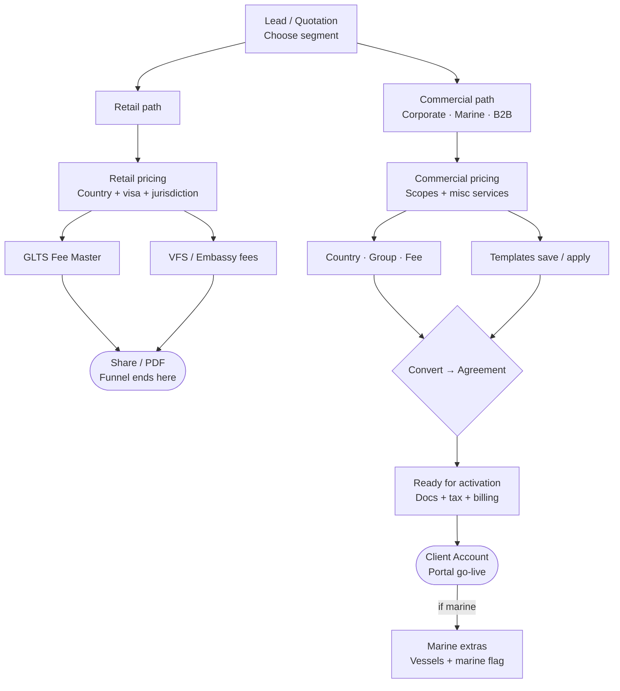
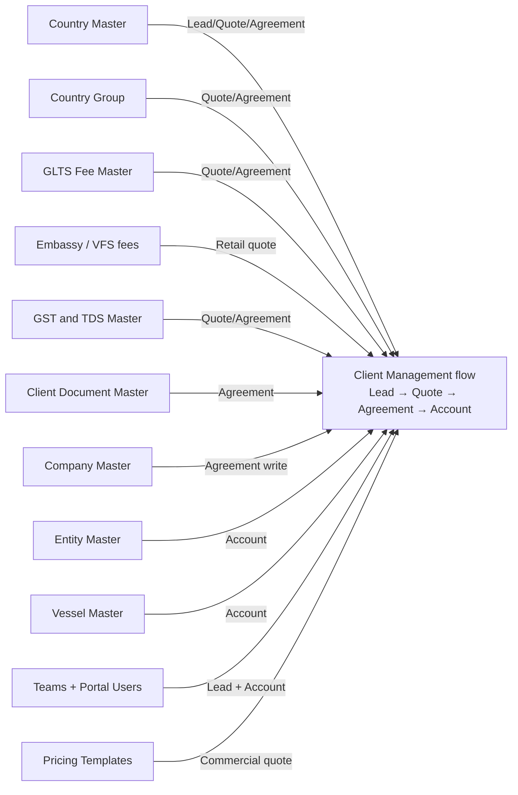
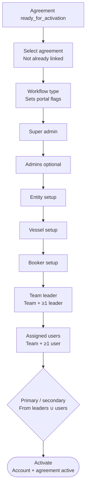
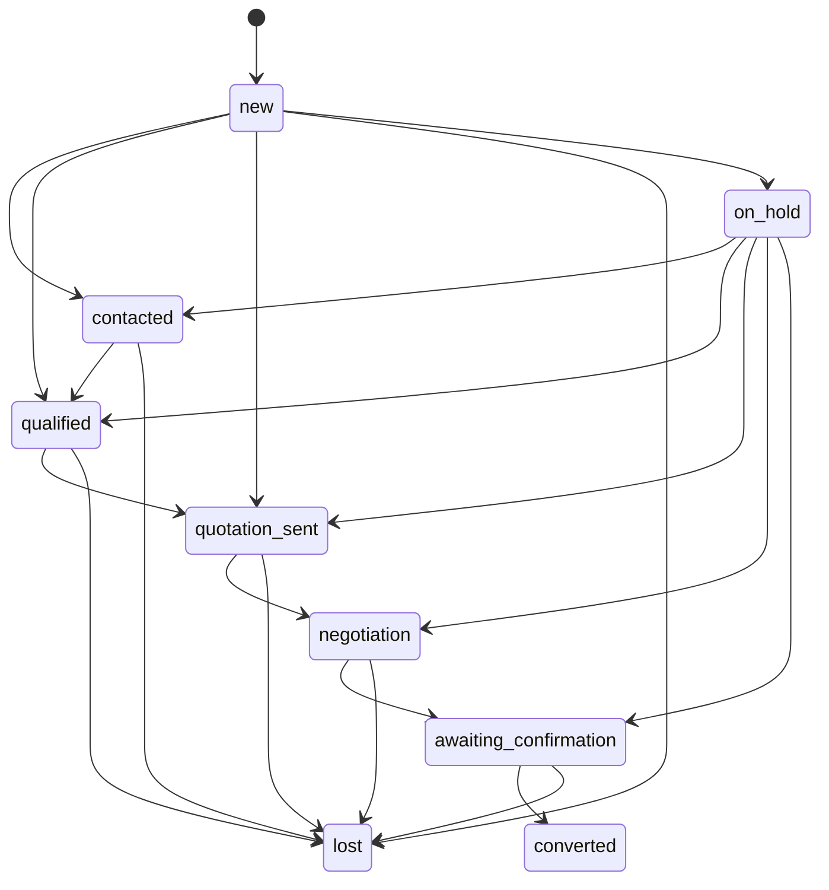

# Client Management — End-to-end flow

Portable flowchart for **Client Management** (`src/pages/admin/customer-accounts`).

View this file in GitHub, VS Code / Cursor Markdown preview, or any Mermaid-capable viewer. You do not need the Cursor Canvas.

| Nav label | Route |
|-----------|-------|
| Lead Management | `/admin/customer-accounts/enquiries` |
| Quotations | `/admin/customer-accounts/quotations` |
| Clients and Agreements | `/admin/customer-accounts/agreements` |
| Client Accounts | `/admin/customer-accounts/corporate-accounts` |

---

## 1. End-to-end funnel

```mermaid
flowchart TB
  subgraph L["1. Lead Management"]
    L1[Create lead<br/>Customer + visa reqs]
    L2[Assign sales team<br/>Team / user / branch]
    L3[Pipeline<br/>New → Contacted → Qualified]
    L4{Convert to Quotation}
    L1 --> L2 --> L3 --> L4
  end

  subgraph Q["2. Quotations"]
    Q1[Customer type<br/>Retail / Corp / Marine / B2B]
    Q2[Build pricing<br/>Retail cards or commercial rules]
    Q3[Pricing templates<br/>Save / apply commercial]
    Q4[Share quotation<br/>→ Quotation Sent]
    Q5[Negotiate<br/>Versions + pipeline]
    Q6{Convert to Agreement<br/>Commercial only}
    Q1 --> Q2 --> Q3 --> Q4 --> Q5 --> Q6
  end

  subgraph A["3. Agreement"]
    A1[Company Master<br/>Create or link]
    A2[Pricing + billing + tax]
    A3[Onboarding documents<br/>Client Document Master]
    A4{Mark ready<br/>ready_for_activation}
    A1 --> A2 --> A3 --> A4
  end

  subgraph C["4. Client Account"]
    C1[Super admin / admins]
    C2[Entities · vessels · bookers]
    C3[Team leader + users<br/>Primary / secondary contact]
    C4([Activate account<br/>Agreement → Active])
    C1 --> C2 --> C3 --> C4
  end

  L4 -->|hydrate customer| Q1
  Q6 -->|version pricing| A1
  A4 -->|hydrate agreement| C1
```

**Retail vs commercial:** Retail quotations share/PDF and stop. Corporate, Marine, and B2B continue through Convert → Agreement → ready_for_activation → Client Account activate.

---

## 2. Segment paths

### Segment mapping

| Lead `customerType` | Quotation / Agreement `workflowType` | Country Master segment |
|---------------------|--------------------------------------|------------------------|
| `retail` | `retail` | `retail` |
| `corporate` | `corporate` | `corporate` |
| `marine` | `marine` | `marine` |
| *(not on lead)* | `b2b_agent` | `b2bAgents` |

B2B Agent is chosen on quotation (not on lead).

---

## 3. Data handoffs

```mermaid
flowchart LR
  Lead[Lead record] --> Map[buildQuotationFormDataFromEnquiry]
  Map --> Quote[Quotation draft<br/>Empty pricing]
  Quote --> Priced[Priced version]
  Priced --> Hydrate[hydrateAgreementFromQuotation]
  Hydrate --> Agr[Agreement draft]
  Agr --> CoM[Company Master write]
  CoM --> Ready[ready_for_activation]
  Ready --> Acc[Account form]
  Acc --> Live([Active account])
```

| Step | Carries forward | Does not carry |
|------|-----------------|----------------|
| Lead → Quotation | Customer identity, contacts, notes, mapped `workflowType`, `enquiryId` | Visa rows, assignment, follow-ups, attachments, ops flags |
| Quotation → Agreement | Selected version commercial pricing, misc services, customer seed, GST %, `workflowType` | Retail quotes (blocked), non-selected versions |
| Agreement save | Company Master create/link, locked pricing, billing/tax, document checklist | — (commercial lock point) |
| Agreement → Account | `agreementId`, company id/name, `workflowType` → portal `workflowConfig` | Admins/teams/entities start empty |
| Account activate | Portal users, entities/vessels/bookers, team leaders/users/contacts | Lead sales assignment is never auto-copied |

---

## 4. Masters map

Most masters are **read** for pickers. **Company / Entity / Vessel / Bookers / Pricing Templates** are **written** during the flow. Teams and Admin Portal Users are selected, not created here.

---

## 5. Client Account + teams

### Two team concepts

| Concept | Where | Purpose | Identity |
|---------|-------|---------|----------|
| Lead assignment | Lead Management | Sales ownership while qualifying | Team **name**, user **fullName** |
| Account Assign user | Client Account step | Ops ownership after go-live | Team **ids**, user **ids** + primary/secondary |

Lead assignment is **not** auto-copied into Client Account assignment.

---

## 6. Submodule roles (quick reference)

| Submodule | Role | Key outcomes |
|-----------|------|--------------|
| Lead Management | Capture & qualify demand | Pipeline, sales assign, convert to quotation |
| Quotations | Price, version, share | Retail or commercial pricing, templates, convert to agreement |
| Agreements | Lock commercial terms | Company Master, billing/tax/docs, ready_for_activation |
| Client Accounts | Portal go-live | Super admin, entities/vessels/bookers, team leaders/users, activate |

---

## 7. Pipeline status (Lead ↔ Quotation)

Shared `ClientManagementPipelineStatus`:

Agreement statuses are separate: `draft` → `ready_for_activation` → `active` (plus `expired` / `on_hold` / `terminated`).

---

## Source code

- Pages: `src/pages/admin/customer-accounts/`
- Shared services: `enquiryService`, `quotationService`, `commercialAgreementService`, `corporateAccountService`
- Pipeline config: `src/shared/config/clientManagementPipelineConfig.ts`
