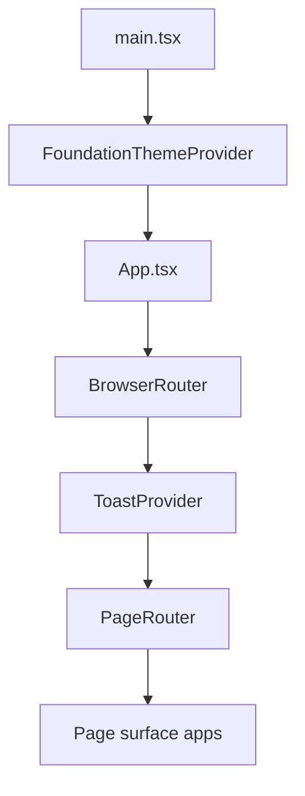
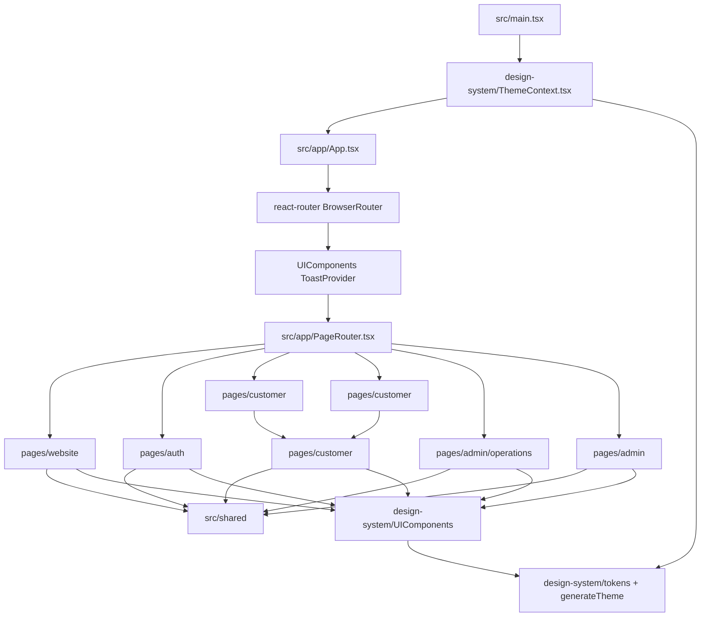
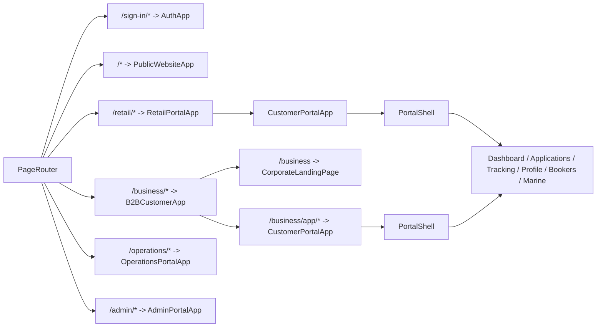
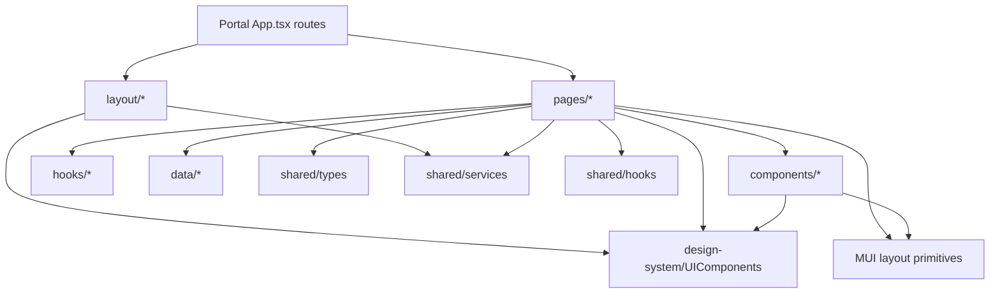
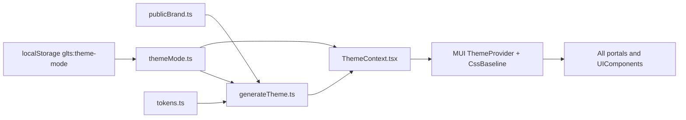
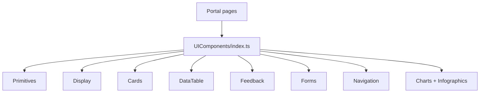
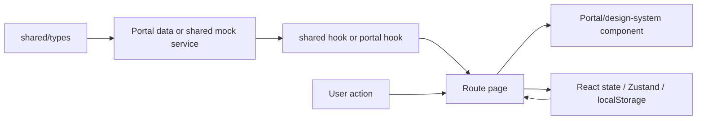

# GLTS Platform — Developer Onboarding

**Start here:** from `foundation/`, run `npm run dev` to start the Vite dev server. Use `npm run build` for a type-checking production build, `npm run lint` for ESLint, and `npm run preview` to serve the built app locally.

This guide describes the current GLTS front-end architecture after the page-first update. The project is no longer only a generic Foundation demo; it is now the client-side application shell for **Greenlight Travel Solutions**, a multi-surface visa application SaaS platform.

---

## 1. Platform Overview

GLTS is a browser-only React + TypeScript SPA built with Vite, React Router, Material UI, Zustand, TipTap, Recharts, and Lucide icons. It has no backend in this repository yet. Authentication and business data are currently modeled through mock services, local storage, and in-memory/static data so the UI can be built before API integration.

The real GLTS product pages live under `src/pages/`. The app has top-level routed page surfaces plus one shared signed-in customer implementation:

| Page surface | URL surface | Purpose | Current entry file |
|---------------|-------------|---------|--------------------|
| `website` | `/`, `/countries`, `/countries/:countryId` | Public GLTS website, landing pages, and visa destination discovery | [`src/pages/website/App.tsx`](../src/pages/website/App.tsx) |
| `auth` | `/sign-in/*` | Portal selection, business login, operations login, forgot password | [`src/pages/auth/AuthApp.tsx`](../src/pages/auth/AuthApp.tsx) |
| `customer` | `/retail/*`, `/business/app/*` | Shared signed-in customer product screens for Retail and B2B | [`src/pages/customer/App.tsx`](../src/pages/customer/App.tsx) |
| `customer` + `website/business` | `/business` | Corporate landing plus B2B app wrapper | [`src/pages/customer/BusinessApp.tsx`](../src/pages/customer/BusinessApp.tsx) |
| `admin/operations` | `/operations/*` | Internal operations dashboard and future case handling | [`src/pages/admin/operations/OperationsPortalApp.tsx`](../src/pages/admin/operations/OperationsPortalApp.tsx) |
| `admin` | `/admin/*` | System administration, internal tools, and removable legacy/admin scaffolds | [`src/pages/admin/App.tsx`](../src/pages/admin/App.tsx) |

New GLTS product screens should go under the owning `src/pages/<surface>/` folder. Retail and B2B customers share [`src/pages/customer/`](../src/pages/customer/). Retail mounts it under `/retail/*`; B2B mounts it under `/business/app/*` while `/business` remains the corporate marketing landing page.

---

## 2. Boot Flow

The application boot order is intentionally small:

1. [`src/main.tsx`](../src/main.tsx) mounts React into `#root`.
2. [`FoundationThemeProvider`](../src/design-system/ThemeContext.tsx) wraps the entire tree and creates the Material UI theme from [`publicBrand.ts`](../src/shared/theme/publicBrand.ts), [`themeMode.ts`](../src/design-system/themeMode.ts), [`generateTheme.ts`](../src/design-system/generateTheme.ts), and [`tokens.ts`](../src/design-system/tokens.ts).
3. [`src/app/App.tsx`](../src/app/App.tsx) adds `BrowserRouter` and the design-system `ToastProvider`.
4. [`src/app/PageRouter.tsx`](../src/app/PageRouter.tsx) chooses the correct page-surface app based on the current URL.
5. Each page surface owns its own internal routes, layouts, pages, and components.



Simplified provider order:

```tsx
createRoot(document.getElementById('root')!).render(
  <StrictMode>
    <FoundationThemeProvider>
      <App />
    </FoundationThemeProvider>
  </StrictMode>,
)
```

---

## 3. Routing Map

[`PageRouter.tsx`](../src/app/PageRouter.tsx) is the top-level router:

| Path | Routed app |
|------|------------|
| `/sign-in/*` | `AuthApp` |
| `/operations/*` | `OperationsPortalApp` |
| `/retail/*` | `RetailPortalApp` |
| `/business/*` | `B2BCustomerApp` |
| `/admin/*` | `AdminPortalApp` |
| `/*` | `PublicWebsiteApp` |

Important current routes:

| URL | Screen |
|-----|--------|
| `/` | Public landing page |
| `/countries` | Country listing |
| `/countries/:countryId` | Country detail |
| `/track` | Public tracking placeholder linking to customer tracking |
| `/sign-in` | Auth portal selection |
| `/sign-in/business` | Business login |
| `/sign-in/operations` | Operations login |
| `/retail` | Redirects to `/retail/dashboard` |
| `/retail/dashboard` | Shared customer dashboard |
| `/retail/applications` | Applications list |
| `/retail/applications/:applicationId` | Application detail |
| `/retail/applications/new` | Create application flow |
| `/retail/tracking` | Tracking page |
| `/business` | Corporate landing page |
| `/business/app/dashboard` | B2B signed-in dashboard |
| `/business/app/bookers` | Booker/team management |
| `/business/app/marine/crew` | Marine crew upload |
| `/operations/dashboard` | Internal operations dashboard |
| `/admin` | Admin placeholder |

When adding routes, add them at the lowest owner that can contain the behavior. Only touch `PageRouter.tsx` when introducing a new top-level portal surface.

---

## 4. Folder Structure

The important structure is:

```text
src/
├── main.tsx
├── app/
│   ├── App.tsx
│   └── PageRouter.tsx
├── design-system/
│   ├── UIComponents/
│   │   ├── Primitives/
│   │   ├── Display/
│   │   ├── Cards/
│   │   ├── Charts/
│   │   ├── DataTable/
│   │   ├── Feedback/
│   │   ├── Forms/
│   │   ├── Navigation/
│   │   ├── Infographics/
│   │   ├── ResponsiveExamples/
│   │   ├── Templates/
│   │   └── index.ts
│   ├── components/
│   ├── ThemeContext.tsx
│   ├── generateTheme.ts
│   ├── themeMode.ts
│   └── tokens.ts
├── pages/
│   ├── admin/
│   │   ├── _tools/
│   │   ├── _legacy/
│   │   └── components/
│   ├── customer/
│   ├── website/
│   ├── auth/
│   └── operations/
└── shared/
    ├── auth/
    ├── components/
    ├── hooks/
    ├── services/
    ├── theme/
    ├── types/
    └── utils/
```

Ownership rules:

- Add real GLTS product pages, layouts, and page-surface-specific components under `src/pages/{admin,customer,website,auth}/`. Internal operations workflows belong under `src/pages/admin/operations/`.
- Add shared signed-in customer behavior under `src/pages/customer/`, not separately under retail and B2B.
- Add cross-surface auth, services, hooks, types, utilities, and public brand helpers under `src/shared/`.
- Do not import page-surface-specific pages from `src/shared/`.
- Add reusable UI primitives and reusable UI components to `src/design-system/UIComponents/` only when multiple product areas should consume them.
- Keep `src/design-system/UIComponents/Templates/` as a scaffold/example layer, not as core reusable primitives or production product pages.
- Use `src/pages/admin/_tools` for internal tools like the component library and `src/pages/admin/_legacy` for removable admin-era scaffolds.

---

## 5. Source Architecture And Connections

This section is the full mental model for `src/`: what each layer owns, how it connects, and which direction dependencies should flow.

### Source Layer Map

| Layer | Files/folders | Owns | Can depend on |
|-------|---------------|------|---------------|
| Entry | `main.tsx` | React DOM mount and top-level theme provider | `App`, `FoundationThemeProvider` |
| App shell root | `App.tsx` | Browser router and global toast provider | `PageRouter`, `ToastProvider` |
| Page router | `PageRouter.tsx` | Top-level URL to page-surface app mapping | Page surface app entry points only |
| Page surface apps | `pages/*` | Routes, pages, layouts, product components for a surface | `shared`, `design-system`, MUI, React Router |
| Shared customer app | `pages/customer` | Signed-in Retail/B2B customer experience | `shared`, `design-system`, route/session helpers |
| Shared app code | `shared/*` | Cross-surface auth, types, mock services, hooks, utilities, public brand helpers | TypeScript, browser APIs, sometimes design-system for shared UI |
| Design-system UI | `design-system/UIComponents/*` | Reusable UI components only: buttons, tables, cards, forms, feedback, navigation, charts | MUI, Emotion, Recharts, TipTap, Zustand, tokens |
| Template/scaffold layer | `design-system/UIComponents/Templates/*` | Module blueprints, scaffolds, and examples | Design-system components and local template helpers |
| Admin tools/legacy layer | `pages/admin/_tools`, `pages/admin/_legacy` | Internal tools and removable scaffolds | Design-system components and admin-only helpers |

### Runtime Connection Graph



Read this graph as a dependency direction rule: entry files compose the app, page-surface apps compose screens, screens consume `shared` and `design-system`, and `shared`/`design-system` should not import page-surface pages. Templates, tools, and removable scaffolds stay outside reusable product code.

### Top-Level Boot Chain

| Step | File | What happens | Why it matters |
|------|------|--------------|----------------|
| 1 | `main.tsx` | Creates the React root and wraps the app with `FoundationThemeProvider` | Every portal receives the same MUI theme context |
| 2 | `ThemeContext.tsx` | Loads/persists theme config, builds the MUI theme, applies `CssBaseline` | Tokens and `sx` values behave consistently everywhere |
| 3 | `App.tsx` | Creates `BrowserRouter` and mounts `ToastProvider` | All portals share routing and toast infrastructure |
| 4 | `PageRouter.tsx` | Chooses the portal app for the current top-level route | Page surface boundaries stay explicit |
| 5 | Page surface app `App.tsx` | Defines nested routes and portal layout | Each portal can evolve without changing the root app |
| 6 | Pages/components | Render feature UI and call shared hooks/services | Product features stay near their portal owner |

### Routing Connection Graph



Important route ownership:

| Route family | Owner | Notes |
|--------------|-------|-------|
| `/`, `/countries`, `/track`, `/pricing` | `PublicWebsiteApp` | Public unauthenticated website |
| `/sign-in`, `/sign-in/business`, `/sign-in/operations` | `AuthApp` | Auth and portal selection |
| `/retail/*` | `RetailPortalApp` wrapper, then `CustomerPortalApp` | Retail signed-in customer app |
| `/business` | `B2BCustomerApp` | Corporate landing page |
| `/business/app/*` | `B2BCustomerApp` wrapper, then `CustomerPortalApp` | B2B signed-in customer app |
| `/operations/*` | `OperationsPortalApp` | Internal team portal |
| `/admin/*` | `AdminPortalApp` | System admin portal |

### Portal Internal Pattern

Most portals should follow this structure:

```text
pages/SomePortal/
├── App.tsx                 # Nested routes for this portal
├── layout/                 # Portal frame, nav, topbar, shell
├── pages/                  # Route-level screens
├── components/             # Portal-only components
├── hooks/                  # Portal-only hooks
├── data/                   # Portal-only mock/config data
└── utils/                  # Portal-only helpers, if needed
```

Typical connection inside a portal:



The page is usually the composition point. It reads route params, gets data from a hook/service/mock, maps that data into component props, and renders portal/design-system components.

### Design System Connections

The design system has two connected responsibilities:

| Area | Files/folders | Connection |
|------|---------------|------------|
| Theme | `ThemeContext.tsx`, `themeMode.ts`, `generateTheme.ts`, `publicBrand.ts`, `tokens.ts` | Maps locked brand tokens + light/dark mode into the MUI theme used by all portals |
| UI API | `UIComponents/index.ts` and category folders | Exposes reusable components that product code imports from the barrel |
| Templates | `UIComponents/Templates` | Provides scaffolds/examples that can inform modules but are not core reusable primitives |

Theme flow:



UI component flow:



Product code should import from the barrel, not from category internals. Category internals can change; the barrel is the stable contract. Product pages should not deep-import template internals from `UIComponents/Templates`; promote a component into the reusable UI API first if it is truly production-ready and broadly reusable.

### Shared Layer Connections

`shared/` is the cross-surface product layer. It should hold things that more than one portal needs or that need to survive the future backend migration. It should not import page-surface-specific pages or layouts.

| Shared folder | Connects to | Purpose |
|---------------|-------------|---------|
| `shared/types` | Services, hooks, page-surface pages | Common contracts such as visa, application, user |
| `shared/services` | Hooks and pages | Mock service functions shaped like future API calls |
| `shared/hooks` | Portal pages/components | Reusable state/data hooks such as country loading |
| `shared/auth` | Auth portal, customer portal shell/sidebar/topbar | Mock session, role, dashboard variant, workspace info |
| `shared/theme` | Public website and customer portal | GLTS public brand colors/fonts |
| `shared/components` | Multiple portals | Small cross-surface components such as `ComingSoonPage` |
| `shared/utils` | Pages/components/services | Pure display and transformation helpers |

Shared dependency rule:

```text
pages/*  -> shared/*
shared/*   -> no page-surface pages
shared/*   -> may use shared types/utilities
services   -> should return typed data
hooks      -> may call services
pages      -> call hooks/services and render UI
```

### Customer Portal Connection Model

Retail and B2B both enter the same customer app:

```text
/retail/*          -> RetailPortalApp -> CustomerPortalApp -> PortalShell -> customer pages
/business/app/*    -> B2BCustomerApp  -> CustomerPortalApp -> PortalShell -> customer pages
```

`usePortalBase` is the bridge that lets shared customer pages know which wrapper they are running under:

| Value | Purpose |
|-------|---------|
| `isBusiness` | True for `/business/*`, false for `/retail/*` |
| `base` | `/business/app` or `/retail`, used for navigation links |
| `session` | Mock logged-in user/customer context |
| `isAdmin` | Whether the current B2B user can manage bookers |
| `contactName`, `companyName` | Display values for topbar/profile/dashboard |

This is why shared customer pages should not hardcode `/retail` or `/business/app`. They should use `base` for internal navigation.

### Data And State Flow

Current data is mock-first:



Use these state locations:

| State type | Current location |
|------------|------------------|
| Theme preferences | `localStorage` through `ThemeContext` |
| Toast queue | Zustand store inside `Feedback/Toast` |
| Mock auth/session | `shared/auth/session.ts` and auth service helpers |
| Listing state | `usePortalListing` or `DataTable` state |
| Wizard state | Portal-local hooks such as `useApplicationFlowState` |
| API/server state | Not integrated yet; keep behind shared services when added |

### Dependency Direction Rules

Allowed:

- `main.tsx` imports `App` and theme provider.
- `App.tsx` imports `PageRouter` and global providers.
- `PageRouter.tsx` imports portal app entry points.
- Portal pages import portal components, shared hooks/services/types, design-system components, and MUI layout utilities.
- Portal wrappers import `CustomerPortalApp` only when they are mounting the shared customer experience.
- Shared hooks import shared services and shared types.
- Design-system components import MUI, tokens, and design-system-local helpers.
- Templates import reusable UI components when they need example scaffolding.

Avoid:

- `shared/*` importing from `pages/*`.
- `design-system/*` importing from `pages/*` or GLTS business data.
- `PageRouter.tsx` importing individual pages.
- Retail and B2B duplicating signed-in customer pages.
- Pages reaching directly into `localStorage` when a shared auth/theme helper exists.
- Product code importing deep design-system component files.
- Product pages deep-importing `UIComponents/Templates` internals.
- Mock API shapes living only inside visual components.
- New GLTS product features being added under `src/pages/`.
- `shared/*` importing page-surface pages, page-surface layouts, or page-surface-specific components.

### Where To Add New Code

| New code | Add it under | Why |
|----------|--------------|-----|
| New public website page | `pages/website/pages` | Owned by public website routing |
| New corporate marketing page | `pages/customer/pages` | B2B public surface, not signed-in app |
| New signed-in customer page | `pages/customer/pages` | Shared by Retail and B2B |
| New customer-only UI block | `pages/customer/components` | Product-specific, not global UI |
| New application wizard control | `pages/customer/components/applications` | Specific to application flow |
| New customer listing helper | `pages/customer/components/listing` or `hooks` | Specific to portal list UX |
| New admin page | `pages/admin/pages` | Admin-only portal |
| New operations page | `pages/admin/operations/pages` | Admin-owned operations workflow |
| New shared type | `shared/types` | Cross-portal data contract |
| New mock/API service | `shared/services` | Replaceable later with backend integration |
| New reusable app hook | `shared/hooks` | Cross-portal state/data behavior |
| New reusable visual component | `design-system/UIComponents/<category>` | UI-only, no GLTS business assumptions |
| New reusable module blueprint | `design-system/UIComponents/Templates` | Scaffold/example only; not a production product page |
| Legacy demo maintenance | `pages` | Only for existing Foundation/demo work pending audit |

---

## 6. Design System Rules

The design system is the UI contract shared by every portal. Portal code should compose product screens out of `UIComponents`, MUI layout primitives, shared types/services, and small page-surface-specific components.

### Import Rules

Use the design-system public API for reusable UI:

```ts
import { Button, Modal, DataTable, ToastProvider } from '@/design-system/UIComponents'
```

`@/design-system/components` currently exists as a compatibility barrel that re-exports `UIComponents`. Existing files may use it, but new work should prefer `@/design-system/UIComponents` so the public API is obvious.

Treat `@/design-system/components` as temporary compatibility only. Do not add new public API there unless it is re-exporting the canonical `UIComponents` API.

Do not import feature components from deep design-system paths:

```ts
// Do not do this in product code.
import Button from '@/design-system/UIComponents/Primitives/Button'
```

Do not import template internals into product pages:

```ts
// Do not do this in product code.
import { SomeTemplateInternal } from '@/design-system/UIComponents/Templates/SomeTemplate'
```

Use MUI for layout, typography, theme helpers, and responsive structure:

```ts
import { Box, Container, Grid, Stack, Typography } from '@mui/material'
import { alpha, useTheme } from '@mui/material/styles'
```

Use the `sx` prop for styling:

```tsx
<Box sx={{ p: 2, bgcolor: 'background.paper' }}>
  <Typography variant="h2">Applications</Typography>
</Box>
```

Avoid inline `style` props, raw CSS media queries, hardcoded design values, and one-off styled divs unless there is a clear reason. Prefer tokens, theme values, responsive `sx`, and existing design-system components. Reusable design-system components should not contain GLTS business rules, route assumptions, portal session logic, or product-specific mock data.

### Tokens And Theme

Design constants live in [`tokens.ts`](../src/design-system/tokens.ts). The current code generates color scales from `BRAND_COLOR`, plus semantic success, warning, info, and error scales.

Use these sources in this order:

| Need | Preferred source |
|------|------------------|
| Brand, semantic, neutral color | `theme.palette.*` or `tokens.color.*` |
| Spacing | MUI spacing numbers in `sx`, for example `p: 2`, `gap: 3` |
| Radius, borders, shadows | `BORDER_RADIUS`, `BORDER_WIDTH`, `SHADOWS`, or component defaults |
| Public website/customer portal marketing colors | `src/shared/theme/publicBrand.ts` |
| Typography | MUI `Typography` variants plus local responsive `sx` when needed |
| Responsive behavior | MUI breakpoint objects in `sx` or `useMediaQuery` for structural rendering |

Before changing `BRAND_COLOR`, spacing tokens, theme breakpoints, shadows, radius, z-index, or transition constants, check all portal surfaces that consume the theme. A theme change affects public website, customer portal, admin/operations shells, and design-system components together.

---

## 7. Design-System Component Inventory

All exports below come through [`src/design-system/UIComponents/index.ts`](../src/design-system/UIComponents/index.ts). If a component is missing from this list, check the folder barrel first before using a deep import.

### Primitives

Primitives are low-level form and action controls. Use these before MUI equivalents for product UI.

| Component | Use it for | Typical GLTS usage |
|-----------|------------|--------------------|
| `Button` | Primary, secondary, outlined, and contained actions | Submit application, create booker, upload documents, export list |
| `IconButton` | Icon-only actions with consistent sizing | Open menus, quick row actions, compact header actions |
| `Input` | Standard text input | Search/filter fields when `SearchInput` is too specific |
| `Textarea` | Multi-line text | Notes, internal remarks, support messages |
| `Select` | Single choice selection | Visa type, country, role, status |
| `MultiSelect` | Multiple choice selection | Filters, tags, permissions, countries |
| `Checkbox` | Binary or multi-select option | Permission toggles, checklist items, terms confirmation |
| `RadioGroup` | Mutually exclusive options | Application mode, traveler category, payment option |
| `Toggle` | On/off setting | Notification preference, enabled/disabled state |
| `DatePicker` | Single date | Travel date, passport expiry, appointment date |
| `DateRangePicker` | Start/end dates | Travel windows, reporting period filters |
| `FileUpload` | File picker/dropzone | Passport upload, supporting documents, bulk upload CSV/XLS |
| `Tooltip` | Short contextual help | Explain disabled actions, status meanings, icons |
| `Divider` | Visual separation | Section breaks inside cards, menus, sidebars |

### Display

Display components show status, identity, copied values, and compact activity information.

| Component | Use it for | Typical GLTS usage |
|-----------|------------|--------------------|
| `Badge` | Counts and small status markers | Unread notifications, pending items |
| `Avatar` | User/customer initials or image | Topbar user, booker identity, applicant avatar |
| `AvatarGroup` | Multiple people | Travelers, assigned operations users |
| `Spinner` | Small loading indicator | Inline loading beside actions |
| `Tag` | Compact label | Visa category, document type, customer segment |
| `CopyButton` | Copy text to clipboard | Application ID, tracking ID, passport number |
| `UserCard` | Identity summary | Booker profile, user management card |
| `NotificationBell` | Bell with badge | Topbar notifications |
| `ActivityFeed` | Timeline-like activity list | Application updates, operations notes, recent dashboard activity |

### Cards

Cards are the preferred way to group dashboard, profile, summary, and action content.

| Component | Use it for | Typical GLTS usage |
|-----------|------------|--------------------|
| `BaseCard` | Generic card container | Custom layouts that still need standard border/radius/shadow |
| `StatCard` | Single KPI with optional trend | Total applications, pending docs, completed visas |
| `MetricCard` | Grouped metric rows | SLA metrics, conversion, monthly totals |
| `ProfileCard` | User/company profile summary | Booker profile, customer company card |
| `ActionCard` | Clickable next-step card | Start new application, upload documents, invite booker |
| `ImageCard` | Image-led card | Destination/country cards, marketing tiles |
| `ListCard` | Small list inside a card | Recent applications, upcoming travel dates |
| `SummaryCard` | Label/value review block | Application review, traveler summary, invoice summary |

### Charts And Infographics

Use chart components for analytics surfaces, admin dashboards, operations dashboards, and KPI trend panels.

| Component | Use it for | Typical GLTS usage |
|-----------|------------|--------------------|
| `LineChart` | Trends over time | Application volume by day/week/month |
| `AreaChart` | Trend with filled volume emphasis | Revenue/application growth |
| `BarChart` | Category comparison | Applications by country, status, team |
| `PieChart` | Simple proportions | Visa types, source channels |
| `DonutChart` | Proportions with center metric | Status mix with total count |
| `ScatterChart` | Relationship between variables | SLA vs volume analysis |
| `RadarChart` | Multi-dimensional comparison | Vendor/country performance |
| `FunnelChart` | Step conversion | Application creation to submission to approval |
| `SparkLine` | Tiny inline trend | KPI cards and table cells |
| `ChartCard` | Chart with title/actions wrapper | Dashboard chart panels |
| `KPIBlock` | Infographic KPI display | Executive dashboard summaries |
| `ProgressRing` | Circular progress | Completion percentage, document progress |
| `Heatmap` | Density grid | Operations workload by day/hour |
| `Timeline` | Chronological events | Application lifecycle |
| `GaugeChart` | Bounded performance score | SLA health, completion score |
| `TreeMap` | Hierarchical proportion | Applications by region/country |
| `ComparisonBar` | Side-by-side comparison | Retail vs B2B, current vs previous period |
| `TrendIndicator` | Directional delta | KPI increase/decrease indicator |

### Data Table

Use these for list-heavy admin, operations, and customer workflows. Prefer the higher-level customer portal listing components when inside `CustomerPortal`. For **admin listings**, prefer `AdminListingTable` inside `AdminListingShell` (see [Admin Module Implementation Guide](./ADMIN_MODULE_IMPLEMENTATION_GUIDE.md)).

| Component | Use it for | Typical GLTS usage |
|-----------|------------|--------------------|
| `DataTable` | Main table engine | Core table; admin listings via `AdminListingTable` wrapper |
| `AdminListingTable` | Admin listing embedded table | Column filters, sticky header, no duplicate toolbar |
| `AdminListingShell` | Admin listing page frame | Header, KPIs, tabs, toolbar slot, table/grid, footer |
| `AdminListingToolbar` | Listing search/actions row | Filter popover, export, view toggle, column picker |
| `ListingFilterPopoverShell` | Filter popover shell | Draft filters, Apply/Clear, anchored to toolbar |
| `AdminListingFilterPopover` | Standard admin filter preset | Country, status, priority fields |
| `TableToolbar` | Search/actions above a standalone table | Non-listing-shell table pages |
| `ColumnHeader` | Sortable/filterable headers | Actions column shows **Actions** label when `key === 'actions'` |
| `FilterPanel` | Multi-filter form/panel | Status, country, visa type, assigned user filters |
| `FilterChip` | Active filter display | Applied filters summary |
| `Pagination` | Page controls | Lists with server/client pagination |
| `RowActions` | Per-row action menu | View, edit, assign, cancel, archive |
| `BulkActions` | Actions on selected rows | Export, assign, status update |
| `EmptyState` | No data UI | No applications, no documents, no search results |
| `InlineEdit` | Edit a value in place | Admin master values, status notes |
| `ExpandedRow` | Detail content under a row | Inline application summary |
| `GlobalSearch` | App-wide search | Search applications, travelers, countries |
| `GlobalSearchProvider`, `useGlobalSearch` | Global search state | Shell-level search experiences |

**Actions column convention:** last column, `key: 'actions'`, `hideable: false`, width 56–60px, sticky right, `sortable/filterable/searchable: false`, `RowActions` in `render`.

### Feedback

Feedback components handle user confirmation, loading, progress, alerts, and overlay workflows.

| Component | Use it for | Typical GLTS usage |
|-----------|------------|--------------------|
| `Alert` | Informational/warning/error messages | Missing documents, payment warning, submission success |
| `ConfirmDialog` | Destructive or important confirmation | Cancel application, delete booker, revoke access |
| `Drawer` | Side panel workflows | Booker form, document upload, filter drawer — title **16px/600** via `overlayHeaderTypography` (not `variant="h6"`); title-only headers are vertically centered, title+subtitle headers are top-aligned |
| `LoadingOverlay` | Blocking loading state | Submitting application, saving profile |
| `Modal` | Focused overlay | Preview document, quick confirmation, small forms — same overlay header title/alignment rule as `Drawer`; use content-driven height (`height: auto`) with viewport-capped `max-height` (no fixed modal heights for standard forms) |
| `Popover` | Anchored lightweight overlay | Column picker, quick filters, status info |
| `ProgressBar` | Linear progress | Upload progress, flow completion |
| `Skeleton`, `SkeletonCard`, `SkeletonList`, `SkeletonTable`, `SkeletonText` | Loading placeholders | Initial list/dashboard loads |
| `ToastProvider` | Global toast renderer | Mounted once in `App.tsx` |
| `useToast` | Trigger toast messages | Save success, upload failed, action complete |

### Forms

Use these for consistent forms and form sections. Some current portal forms still use MUI `TextField`; prefer migrating new form work toward these design-system controls unless a MUI-only component is needed.

| Component | Use it for | Typical GLTS usage |
|-----------|------------|--------------------|
| `FormActions` | Submit/cancel action row | Wizard footer, drawer footer — buttons use theme `BUTTON` token (`10px` radius, `13px` type) |
| `FormField` | Label/help/error wrapper | Consistent field layout around custom controls |
| `FormSection` | Group fields under a heading | Traveler details, passport details, company details |
| `RichTextEditor` | Rich text input | Email templates, internal notes, support articles |
| `SearchInput` | Search-specific input | Listing toolbar search |
| `TagInput` | Enter multiple tokens | Tags, aliases, allowed domains |

**Form/button tokens:** `src/design-system/formControl.ts` exports `FORM_CONTROL` and `BUTTON` — keep in sync with root `CLAUDE.md`. Component library **Forms** tab includes `AdminFormPatternsGuide` for modal, drawer, full-page, and stepper shells.

### Admin module shells

Admin-specific composition lives in `src/pages/admin/components/`. These are not design-system exports — import from `@/pages/admin/components/...` when building admin modules.

| Component | Use it for |
|-----------|------------|
| `AdminListingShell` | Listing page frame (header, KPIs, tabs, toolbar, content, footer) |
| `AdminListingStickyHeader` | Sticky listing title + primary CTA |
| `AdminListingToolbar` | Search, Filter popover, export, table/grid toggle, column picker |
| `ListingFilterPopoverShell` | Shared filter popover shell (Apply/Clear) |
| `AdminListingTable` | Embedded `DataTable` + column filters |
| `AdminListingGrid` | Card grid listing mode |
| `AdminDetailShell` | Detail page frame + breadcrumbs |
| `AdminFullPageFormShell` | Full-page create/edit with section cards |
| `AdminFullPageFormFooter` | Sticky save/cancel footer |
| `AdminDrawerFormShell` | Drawer create/edit |
| `AdminStepperFormShell` | Multi-step form with review |
| `AdminOverlayFormSection` | Primary/secondary section cards in drawer/stepper |
| `AdminPageHeader` | Generic admin page header |

Layout token files: `adminFullPageFormLayout.ts`, `adminOverlayFormLayout.ts`.

**Implementation guide:** [Admin Module Implementation Guide](./ADMIN_MODULE_IMPLEMENTATION_GUIDE.md) — recipes mapped to `/admin/tools/templates` and `/admin/tools/component-library`.

### Navigation

Navigation components are shared shell and navigation building blocks. Customer portal has its own page-surface-specific shell components; use these design-system components for generic shells and non-customer surfaces.

| Component | Use it for | Typical GLTS usage |
|-----------|------------|--------------------|
| `AppShell` | Generic app chrome | Admin/operations shell if they adopt generic layout |
| `Topbar` | Generic top navigation | Non-customer authenticated surfaces |
| `Sidebar` | Generic side navigation | Admin/operations nav |
| `Breadcrumb` | Hierarchical location | Detail pages, admin forms |
| `Tabs` | Section switching | Application detail tabs, listing tabs |
| `Menu` | Command/action menu | Row actions, user actions |
| `Stepper` | Generic step flow | Wizards outside the customer application flow |
| `BackButton` | Standard back action | Detail pages, create flows |
| `CommandPalette` | Keyboard command/search palette | Global shortcuts in authenticated surfaces |

---

## 8. Portal-Level Components

Portal-level components are not global design-system components. They encode GLTS product behavior and should stay near the portal that owns them.

### Public Website Components

| Component | Location | Use it for |
|-----------|----------|------------|
| `PublicLayout` | [`src/pages/website/components/PublicLayout.tsx`](../src/pages/website/components/PublicLayout.tsx) | Public website page frame with header/footer behavior |
| `PublicHeader` | [`src/pages/website/components/PublicHeader.tsx`](../src/pages/website/components/PublicHeader.tsx) | Marketing/header navigation |
| `PublicContainer` | [`src/pages/website/components/PublicContainer.tsx`](../src/pages/website/components/PublicContainer.tsx) | Consistent public page max width and horizontal padding |
| `DestinationListingCard` | [`src/pages/website/components/DestinationListingCard.tsx`](../src/pages/website/components/DestinationListingCard.tsx) | Country/destination list cards |
| `MobileStickyCta` | [`src/pages/website/components/MobileStickyCta.tsx`](../src/pages/website/components/MobileStickyCta.tsx) | Mobile bottom call-to-action |

### Customer Portal Layout Components

| Component | Location | Use it for |
|-----------|----------|------------|
| `CustomerPortalApp` | [`src/pages/customer/App.tsx`](../src/pages/customer/App.tsx) | Shared signed-in customer routes |
| `PortalShell` | [`src/pages/customer/features/shared/layout/PortalShell.tsx`](../src/pages/customer/features/shared/layout/PortalShell.tsx) | Customer portal frame, mobile sidebar state, topbar, route outlet |
| `PortalSidebar` | [`src/pages/customer/features/shared/layout/PortalSidebar.tsx`](../src/pages/customer/features/shared/layout/PortalSidebar.tsx) | Customer navigation, business/admin/marine nav gating, logout |
| `PortalTopbar` | [`src/pages/customer/features/shared/layout/PortalTopbar.tsx`](../src/pages/customer/features/shared/layout/PortalTopbar.tsx) | Customer search, notifications, profile entry, mobile menu trigger |
| `usePortalBase` | [`src/pages/customer/hooks/usePortalBase.ts`](../src/pages/customer/hooks/usePortalBase.ts) | Compute `/retail` vs `/business/app`, session, role, contact/company |
| `canManageBookers` | [`src/pages/customer/hooks/usePortalBase.ts`](../src/pages/customer/hooks/usePortalBase.ts) | Role helper for booker management permissions |

### Customer Listing Components

Use this stack for customer-facing list screens such as applications, bookers, documents, and future invoices. It wraps the lower-level design-system table components with GLTS-specific layout.

| Component/hook | Location | Use it for |
|----------------|----------|------------|
| `PortalListingShell` | [`src/pages/customer/features/shared/components/listing/PortalListingShell.tsx`](../src/pages/customer/features/shared/components/listing/PortalListingShell.tsx) | Page title, header actions, KPI row, tabs, toolbar, table/grid, pagination container |
| `CustomerListingToolbar` | [`src/pages/customer/features/shared/components/listing/CustomerListingToolbar.tsx`](../src/pages/customer/features/shared/components/listing/CustomerListingToolbar.tsx) | Search, Filter popover, export, table/grid toggle, column picker |
| `PortalListingTable` | [`src/pages/customer/features/shared/components/listing/PortalListingTable.tsx`](../src/pages/customer/features/shared/components/listing/PortalListingTable.tsx) | Embedded `DataTable` with column filters and no duplicated toolbar/pagination |
| `PortalListingGrid` | [`src/pages/customer/features/shared/components/listing/PortalListingGrid.tsx`](../src/pages/customer/features/shared/components/listing/PortalListingGrid.tsx) | Card/grid alternative for small screens or user-selected grid view |
| `PortalListingPagination` | [`src/pages/customer/features/shared/components/listing/PortalListingPagination.tsx`](../src/pages/customer/features/shared/components/listing/PortalListingPagination.tsx) | Footer pagination wrapper |
| `PortalListingKpis` | [`src/pages/customer/features/shared/components/listing/PortalListingKpis.tsx`](../src/pages/customer/features/shared/components/listing/PortalListingKpis.tsx) | Compact KPI strip above listings |
| `usePortalListing` | [`src/pages/customer/hooks/usePortalListing.ts`](../src/pages/customer/hooks/usePortalListing.ts) | Client-side search, column filtering, sorting, pagination state |

Customer listing composition should generally look like this:

```tsx
<PortalListingShell
  title="Application management"
  kpis={kpis}
  tabs={tabs}
  tabValue={tabValue}
  onTabChange={setTabValue}
  headerActions={<Button>New application</Button>}
  toolbar={
    <PortalListingToolbar
      searchValue={tableState.searchQuery}
      onSearch={handleSearch}
      onExport={handleExport}
      viewMode={viewMode}
      onViewModeChange={setViewMode}
      columns={columns}
      hiddenColumnKeys={tableState.hiddenColumnKeys}
      onHiddenColumnKeysChange={handleHiddenColumns}
    />
  }
  table={viewMode === 'table' ? <PortalListingTable {...tableProps} /> : <PortalListingGrid {...gridProps} />}
  pagination={<PortalListingPagination page={tableState.page} pageSize={tableState.pageSize} total={total} onPage={handlePage} onPageSize={handlePageSize} />}
/>
```

### Customer Application Flow Components

Use these only inside the customer application creation/upload workflows unless a future portal needs exactly the same behavior.

| Component/hook | Location | Use it for |
|----------------|----------|------------|
| `ApplicationFlowStepper` | [`src/pages/customer/features/applications/components/ApplicationFlowStepper.tsx`](../src/pages/customer/features/applications/components/ApplicationFlowStepper.tsx) | Segmented application wizard progress |
| `PortalCountryCard` | [`src/pages/customer/features/applications/components/PortalCountryCard.tsx`](../src/pages/customer/features/applications/components/PortalCountryCard.tsx) | Country card selection inside portal flows |
| `UploadQueueTable` | [`src/pages/customer/features/applications/components/UploadQueueTable.tsx`](../src/pages/customer/features/applications/components/UploadQueueTable.tsx) | Uploaded document/passport queue |
| `PassportPreviewCard` | [`src/pages/customer/features/applications/components/PassportPreviewCard.tsx`](../src/pages/customer/features/applications/components/PassportPreviewCard.tsx) | Passport image/data preview |
| `ExtractedFieldsReview` | [`src/pages/customer/features/applications/components/ExtractedFieldsReview.tsx`](../src/pages/customer/features/applications/components/ExtractedFieldsReview.tsx) | OCR/extracted field review |
| `DocumentChecklistPanel` | [`src/pages/customer/features/applications/components/DocumentChecklistPanel.tsx`](../src/pages/customer/features/applications/components/DocumentChecklistPanel.tsx) | Required/supporting document checklist |
| `useApplicationFlowState` | [`src/pages/customer/features/applications/hooks/useApplicationFlowState.ts`](../src/pages/customer/features/applications/hooks/useApplicationFlowState.ts) | Shared state for the create application flow |

### B2B/Booker Components

| Component | Location | Use it for |
|-----------|----------|------------|
| `BookerFormDrawer` | [`src/pages/customer/features/bookers/components/BookerFormDrawer.tsx`](../src/pages/customer/features/bookers/components/BookerFormDrawer.tsx) | Create/edit booker side drawer with permissions |

Booker and marine features live in `CustomerPortal` because they are part of the signed-in customer app, but they should be gated by business route/session context. Do not place these under `RetailCustomerPortal` unless the retail wrapper itself needs unique behavior.

---

## 9. Screen Recipes

Use these recipes when deciding which components belong on a new screen.

Public website pages can be visually more flexible because they serve marketing and discovery needs, but they still must follow global brand, typography, spacing, theme, and responsive rules. Customer, Admin, and Operations page-surface pages should follow stricter page recipes so authenticated workflows stay consistent and maintainable.

### Public Marketing Page

Use:

- `PublicLayout` for the page frame.
- `PublicContainer` for content width.
- MUI `Box`, `Stack`, `Grid`, `Typography` for responsive layout.
- `Button`, `ImageCard`, `ActionCard`, `Accordion`-style MUI components only if needed.
- `MobileStickyCta` when the page has a mobile conversion action.

Add the route in `PublicWebsite/App.tsx`. Keep public pages unauthenticated and do not depend on customer portal session state.

### Public Country Listing Or Country Detail

Use:

- `DestinationListingCard` for destination list tiles.
- `useCountries` and `visaService` for current mock country/visa data.
- `PublicContainer` and MUI responsive layout.
- `Tag`, `Badge`, `SummaryCard`, or `ListCard` for compact visa facts.

If the country data shape changes, update `shared/types/visa.ts` and `visaService.ts` before changing page code.

### Auth Page

Use:

- `SplitAuthLayout` for login/forgot-password surfaces.
- Existing auth page components under `src/pages/auth/`.
- `Button`, `Input`, `FormField`, `Alert`, and `useToast` for form feedback where possible.
- `authService` and `session` helpers for mock login/session changes.

Do not implement real authentication directly in page components. Shape changes should go through `src/shared/services/authService.ts` and `src/shared/auth/session.ts`.

### Customer Dashboard

Use:

- `PortalShell` automatically through `CustomerPortal/App.tsx`.
- `StatCard`, `MetricCard`, `ListCard`, `ActivityFeed`, `ChartCard`, and chart components for dashboard blocks.
- `usePortalBase` when content changes for Retail vs B2B.
- `dashboardConfig` for business variants and customer-type behavior.

Dashboards should show summaries and next actions, not duplicate full listing behavior.

### Customer Listing Page

Use:

- `usePortalListing` for search/filter/sort/page state when data is local/mock.
- `PortalListingShell` for the full page structure.
- `PortalListingKpis` for small KPI summaries.
- `PortalListingToolbar` for search/export/view/columns/more actions.
- `PortalListingTable` for table view.
- `PortalListingGrid` for grid view.
- `PortalListingPagination` for footer controls.
- `DataTable` only directly when the listing is not in the customer portal stack.

Keep row shape typed. Put row formatting helpers near the page, but put reusable data contracts in `src/shared/types/`.

### Application Detail Page

Use:

- `BackButton` or a local back action.
- `Tabs` for major sections such as overview, travelers, documents, activity.
- `SummaryCard` for read-only label/value groups.
- `DocumentChecklistPanel`, `PassportPreviewCard`, and `ActivityFeed` where relevant.
- `Badge`, `Tag`, or a surface-local status component for status labels.
- `Button`, `Menu`, `ConfirmDialog`, `Drawer`, or `Modal` for actions.

Application detail pages should read from a service/mock source and route param, not from list row state only.

### Create Application Flow

Use:

- `ApplicationFlowStepper` for the wizard progress.
- `useApplicationFlowState` for shared flow state.
- `ApplicationActionStep` to choose single/bulk where applicable.
- `PortalCountryCard` for country selection.
- `DatePicker` for travel dates.
- `FileUpload`, `UploadQueueTable`, `PassportPreviewCard`, `ExtractedFieldsReview`, and `DocumentChecklistPanel` for upload/review stages.
- `FormSection`, `FormField`, `FormActions`, `Button`, `Alert`, and `ProgressBar` for form structure and feedback.

Do not create a new stepper for this flow. If another step is required, extend the data/config used by the current flow and preserve route redirects for existing in-progress paths where needed.

### B2B Booker Management

Use:

- `PortalListingShell` listing stack for booker lists.
- `BookerFormDrawer` for create/edit.
- `UserCard`, `ProfileCard`, `Avatar`, `Badge`, and `Tag` for identity and permission display.
- `canManageBookers` and session role checks for access behavior.
- `ConfirmDialog` for deactivate/delete/revoke actions.

Booker permissions should stay typed using the portal mock data/types until API contracts exist.

### Marine Crew Upload

Use:

- Customer application/upload components where the workflow overlaps.
- `FileUpload`, `UploadQueueTable`, `ProgressBar`, `Alert`, and `DataTable`/`PortalListingTable`.
- `dashboardConfig`/session context to show marine navigation only for the right B2B customer type.

Keep batch upload parsing and validation logic outside visual components when it grows beyond simple mock behavior.

### Operations Dashboard

Use:

- A page-surface-specific operations layout when it exists; until then, keep the operations entry small.
- `StatCard`, `MetricCard`, `ChartCard`, `DataTable`, `FilterPanel`, `RowActions`, and `ActivityFeed`.
- `Badge`/`Tag` for case status, priority, SLA, and assignment.
- `Drawer` or `Modal` for assignment and quick updates.

Operations should eventually use shared application/document types rather than inventing operations-only duplicates.

### Admin Portal

Use:

- `AppShell`, `Sidebar`, `Topbar`, `Breadcrumb`, `DataTable`, `FilterPanel`, `Modal`, `Drawer`, `ConfirmDialog`, and `FormSection` once the admin portal moves beyond placeholder.
- `InlineEdit` for master-data edits when the change is simple and low risk.
- `Tabs` for large admin detail pages.

Admin screens usually need stronger confirmation and audit patterns than customer screens. Prefer explicit save/cancel flows over automatic mutation.

---

## 10. Customer Portal Architecture

[`src/pages/customer/`](../src/pages/customer/) is the shared signed-in experience. This is where most customer-facing product work should happen.

Key files:

| Location | Role |
|----------|------|
| [`CustomerPortal/App.tsx`](../src/pages/customer/App.tsx) | Shared customer routes |
| [`CustomerPortal/features/shared/layout/PortalShell.tsx`](../src/pages/customer/features/shared/layout/PortalShell.tsx) | Main signed-in layout and outlet |
| [`CustomerPortal/features/shared/layout/PortalSidebar.tsx`](../src/pages/customer/features/shared/layout/PortalSidebar.tsx) | Customer navigation sidebar, mobile drawer, logout, B2B/admin/marine nav gating |
| [`CustomerPortal/features/shared/layout/PortalTopbar.tsx`](../src/pages/customer/features/shared/layout/PortalTopbar.tsx) | User avatar, notifications, customer search, mobile menu |
| [`CustomerPortal/features/dashboard/pages/DashboardPage.tsx`](../src/pages/customer/features/dashboard/pages/DashboardPage.tsx) | KPI cards and recent activity |
| [`CustomerPortal/features/applications/pages/ApplicationsListPage.tsx`](../src/pages/customer/features/applications/pages/ApplicationsListPage.tsx) | Listing, filters, pagination |
| [`CustomerPortal/features/applications/pages/ApplicationDetailPage.tsx`](../src/pages/customer/features/applications/pages/ApplicationDetailPage.tsx) | Application detail |
| [`CustomerPortal/features/applications/pages/create/`](../src/pages/customer/features/applications/pages/create/) | Create application flow |
| [`CustomerPortal/features/bookers/pages/BookersPage.tsx`](../src/pages/customer/features/bookers/pages/BookersPage.tsx) | B2B booker/team management |
| [`CustomerPortal/features/marine/pages/`](../src/pages/customer/features/marine/pages/) | Marine crew upload features |
| [`CustomerPortal/features/shared/components/listing/`](../src/pages/customer/features/shared/components/listing/) | Listing shell, toolbar, table, grid, pagination |
| [`CustomerPortal/features/applications/components/`](../src/pages/customer/features/applications/components/) | Application-specific building blocks |
| [`CustomerPortal/data/`](../src/pages/customer/data/) | Mock data and IDs for the current portal flow |

Because Retail and B2B share this portal, avoid duplicating customer pages under `RetailCustomerPortal` or `B2BCustomerPortal`. Use `usePortalBase`, mock session data, and shared configuration to branch behavior when Retail and B2B need different navigation, copy, permissions, or feature access.

The wrapper portals should stay thin:

- `RetailCustomerPortal/App.tsx` should route `/retail/*` into `CustomerPortalApp`.
- `B2BCustomerPortal/App.tsx` should keep `/business` as corporate landing and route `/business/app/*` into `CustomerPortalApp`.
- If B2B needs public marketing pages, add them under `B2BCustomerPortal/pages/`.
- If B2B needs signed-in app behavior, add it under `CustomerPortal/` and gate it with route/session context.

---

## 11. Shared Code And Mock Data

The backend has not been integrated yet. Current data and auth boundaries are:

| Area | Files | Notes |
|------|-------|-------|
| Auth/session | [`src/shared/auth/session.ts`](../src/shared/auth/session.ts), [`src/shared/auth/dashboardConfig.ts`](../src/shared/auth/dashboardConfig.ts), [`src/shared/services/authService.ts`](../src/shared/services/authService.ts) | Mock/local session behavior and portal dashboard configuration |
| Visa data | [`src/shared/services/visaService.ts`](../src/shared/services/visaService.ts), [`src/shared/hooks/useCountries.ts`](../src/shared/hooks/useCountries.ts), [`src/shared/types/visa.ts`](../src/shared/types/visa.ts) | Mock country and visa service data |
| Application types | [`src/shared/types/application.ts`](../src/shared/types/application.ts) | Shared application contracts |
| User types | [`src/shared/types/user.ts`](../src/shared/types/user.ts) | User and portal-related typing |
| Public brand | [`src/shared/theme/publicBrand.ts`](../src/shared/theme/publicBrand.ts) | Public website typography and brand helpers |
| Shared UI | [`src/shared/components/ComingSoonPage.tsx`](../src/shared/components/ComingSoonPage.tsx) | Cross-portal placeholder page |
| Utilities | [`src/shared/utils/countryDisplay.ts`](../src/shared/utils/countryDisplay.ts) | Shared display helpers |

When building a feature, start with typed mock data or an existing mock service. Keep the service boundary shaped like the future API so replacing it later does not require rewriting page components.

Service boundary rules:

- Page components may transform data for display, but should not own core mock data definitions.
- Shared data contracts belong in `src/shared/types/`.
- Data fetching/mock reads belong in `src/shared/services/` or surface-local `data/` if the data is strictly temporary and page-surface-specific.
- Session-dependent behavior should go through `src/shared/auth/` or `usePortalBase`.
- When the backend arrives, replace mock service internals before changing every page.

---

## 12. External Dependencies

The current package versions are defined in [`package.json`](../package.json). Important dependencies:

| Package | Role |
|---------|------|
| `react`, `react-dom` | UI runtime |
| `vite`, `@vitejs/plugin-react` | Dev server, HMR, build tooling |
| `typescript`, `eslint`, `typescript-eslint` | Type-checking and linting |
| `react-router-dom` | Portal and page routing |
| `@mui/material`, `@emotion/*` | Layout, theme, and MUI component foundation |
| `lucide-react` | Icons |
| `zustand` | Toast/global lightweight state |
| `recharts` | Charts |
| `@tiptap/*` | Rich text editor features |
| `dayjs` | Date formatting |
| `chroma-js` | Token and theme color scale generation |

React Hook Form and Zod are not currently installed. If a future form flow needs them, add them deliberately and keep form contracts typed.

---

## 13. How To Build Features

Before writing code, decide the ownership:

| Feature type | Add it here |
|--------------|-------------|
| Public marketing or country browsing | `src/pages/website/` |
| Sign-in, forgot password, portal selection | `src/pages/auth/` |
| Retail-only wrapper behavior | `src/pages/customer/` |
| B2B landing or B2B-only wrapper behavior | `src/pages/customer/` |
| Shared signed-in customer screens | `src/pages/customer/` |
| Internal operations screens | `src/pages/admin/operations/` |
| System admin screens | `src/pages/admin/` |
| Cross-portal data contracts/services/hooks | `src/shared/` |
| Reusable UI used by many areas | `src/design-system/UIComponents/` |
| Template or scaffold examples | `src/design-system/UIComponents/Templates/` |
| Admin tools and removable scaffolds | `src/pages/admin/_tools`, `src/pages/admin/_legacy` for internal utilities and temporary pages |

Feature checklist:

- Import reusable UI from `@/design-system/UIComponents`.
- Treat `@/design-system/components` as a temporary compatibility barrel.
- Do not deep-import `UIComponents/Templates` internals into product pages.
- Import layout primitives from `@mui/material`.
- Use `sx`, theme values, and tokens instead of `style`.
- Add explicit TypeScript props and shared types where useful.
- Use mock services first; do not hardwire page components to temporary data shapes.
- Add new GLTS product features under the owning `src/pages/<surface>/` folder.
- Test responsive behavior across mobile, tablet, and desktop.
- Run `npm run build` before handing off wide route or type changes.

### Generic Feature Pattern

```tsx
import { Box, Container, Grid, Typography } from '@mui/material'
import { Button, DataTable, FilterPanel, StatCard } from '@/design-system/UIComponents'

export function ApplicationsList() {
  return (
    <Container maxWidth="lg">
      <Typography variant="h2" sx={{ mb: 3 }}>
        Applications
      </Typography>

      <Grid container spacing={2} sx={{ mb: 3 }}>
        <Grid size={{ xs: 12, sm: 6, md: 3 }}>
          <StatCard title="Total" value="24" />
        </Grid>
      </Grid>

      <Box sx={{ mb: 3 }}>
        <FilterPanel columns={filterColumns} onChange={setFilters} />
      </Box>

      <DataTable columns={tableColumns} data={applications} onRowClick={handleRowClick} />

      <Button>New application</Button>
    </Container>
  )
}
```

---

### Build Decision Tree

Use this decision tree before adding files:

1. Is this a top-level portal URL? Update `PageRouter.tsx` only if the answer is yes.
2. Is this a public/marketing page? Add it under `PublicWebsite` or `B2BCustomerPortal` depending on audience.
3. Is this a signed-in customer feature? Add it under `CustomerPortal`.
4. Is it B2B-only but signed in? Add it under `CustomerPortal` and gate it with `usePortalBase`/session config.
5. Is it only a retail wrapper concern? Add it under `RetailCustomerPortal`.
6. Is it reusable across portals but not visual? Add it under `shared`.
7. Is it reusable visual UI with no GLTS business assumptions? Add it under `design-system/UIComponents`.
8. Is it a module blueprint, scaffold, or example? Add it under `design-system/UIComponents/Templates`, and do not treat it as a product page.
9. Is it an internal tool or removable scaffold? Keep it under `src/pages/admin/_tools` or `src/pages/admin/_legacy`.
10. Is it a page-specific helper? Keep it near the page until a second use appears.

### Naming And Typing

- Components: PascalCase, for example `ApplicationDetailPage`.
- Hooks: `useSomething`, for example `usePortalListing`.
- Types/interfaces: descriptive nouns, for example `ApplicationRecord`, `PortalListingTab`.
- Event handlers: `handleSomething` inside components, `onSomething` in props.
- Type-only imports: use `import type` when importing types.
- Props: define explicit props interfaces for reusable components.
- Avoid `any`; use shared contracts or generics.

### Responsive Rules

- Use `sx={{ ... }}` breakpoint objects for style changes.
- Use `useMediaQuery` only when the rendered structure changes.
- Prefer MUI `Grid` or CSS grid in `sx` for responsive card/list layouts.
- Customer page-surface pages live inside a scrolling `main` from `PortalShell`; avoid adding nested full-page scroll containers unless necessary.
- Test at mobile width, tablet width, and desktop width before considering a portal page complete.

---

## 14. Current Status And Phases

Current status in the codebase:

- Foundation setup, theme provider, design-system structure, and portal routing are in place.
- Public website routes and country pages exist.
- Auth portal shell and sign-in related pages exist.
- Customer portal core is actively implemented: shell, dashboard, application listing/detail, create application flow, tracking, bookers, profile, and marine crew upload are present.
- Operations portal currently has an internal dashboard entry.
- Admin portal is still a placeholder.
- `src/design-system/UIComponents/Templates/` contains scaffold/example code such as the billing module template.
- `src/pages/` is the production page root. Internal tools belong in `src/pages/admin/_tools`; removable scaffolds belong in `src/pages/admin/_legacy`.
- API integration and real authentication have not started.

Development phases:

| Phase | Status | Focus |
|-------|--------|-------|
| 1. Foundation | Complete | Vite, TypeScript, MUI, theme, design-system base |
| 2. Design System Polish | In progress | Spacing, typography, colors, shadows, hover states |
| 3. Customer Portal Core | In progress | Portal shell, dashboard, applications, tracking, shared customer components |
| 4. B2B Features | In progress/partial | Corporate landing, bookers, marine crew upload, bulk flows |
| 5. Admin Portal | Not started | Admin dashboard, users, customers, masters, reporting |
| 6. Operations Portal | Started lightly | Internal dashboard, future case and document workflows |
| 7. Polish And Launch | Not started | API integration, auth, notifications, payments, tests, optimization |

---

## 15. High-Risk Changes

Treat these as architecture-level changes:

- Changing `PageRouter.tsx` top-level route ownership.
- Moving Retail or B2B away from the shared `CustomerPortal` without a product decision.
- Editing `generateTheme.ts`, `tokens.ts`, breakpoint values, or theme persistence keys.
- Renaming shared types that mock services and page-surface pages already consume.
- Adding deep design-system imports in product code.
- Introducing a backend/API shape directly inside page components instead of shared services.
- Turning page-surface-specific GLTS behavior into global design-system components too early.
- Duplicating customer signed-in pages under both Retail and B2B instead of sharing `CustomerPortal`.
- Replacing the customer portal listing stack with one-off list/table implementations without a strong reason.
- Adding real auth or API assumptions before shared service contracts are ready.
- Treating `src/pages/admin/_tools` or `src/pages/admin/_legacy` files as final production features without an audit.
- Deleting, moving, or removing legacy/demo/template code before a documented audit.
- Promoting template internals into product portals through deep imports instead of moving reusable UI into the canonical `UIComponents` API.

If a change affects more than one portal, update the shared types/services or customer portal layer first, then let the portal wrappers stay thin.

---

## 16. Component Usage Quick Reference

Use this table when starting a new page:

| Page or feature | First components to reach for |
|-----------------|-------------------------------|
| Public landing section | `PublicLayout`, `PublicContainer`, `Button`, `ImageCard`, MUI `Box/Grid/Typography` |
| Country listing | `DestinationListingCard`, `SearchInput`, `Tag`, `Badge`, `useCountries` |
| Login/forgot password | Auth layout/components, `Button`, `Input`, `FormField`, `Alert`, `useToast` |
| Customer dashboard | `StatCard`, `MetricCard`, `ListCard`, `ActivityFeed`, `ChartCard`, `SparkLine` |
| Customer applications list | `PortalListingShell`, `PortalListingToolbar`, `PortalListingTable`, `PortalListingGrid`, `PortalListingPagination`, `usePortalListing` |
| Customer application detail | `Tabs`, `SummaryCard`, `DocumentChecklistPanel`, `ActivityFeed`, `BackButton`, `ConfirmDialog` |
| Create application wizard | `ApplicationFlowStepper`, `ApplicationActionStep`, `PortalCountryCard`, `DatePicker`, `FileUpload`, `UploadQueueTable`, `FormActions` |
| Document upload/review | `FileUpload`, `UploadQueueTable`, `PassportPreviewCard`, `ExtractedFieldsReview`, `DocumentChecklistPanel`, `ProgressBar` |
| Booker management | `PortalListingShell`, `BookerFormDrawer`, `UserCard`, `Avatar`, `Tag`, `ConfirmDialog` |
| Marine crew upload | `FileUpload`, `UploadQueueTable`, `DataTable`, `Alert`, `ProgressBar` |
| Operations dashboard | `StatCard`, `MetricCard`, `DataTable`, `FilterPanel`, `RowActions`, `ChartCard` |
| Admin list page | `AdminListingShell`, `AdminListingTable`, `AdminListingToolbar`, `RowActions`, `Pagination` — see [Admin Module Implementation Guide](./ADMIN_MODULE_IMPLEMENTATION_GUIDE.md) |
| Admin edit form | `AdminDrawerFormShell` or `Modal`, `AdminFullPageFormShell`, `FormSection`, `FormField`, `ConfirmDialog` |
| Product template standards | [root CLAUDE.md](../CLAUDE.md), [Admin Module Implementation Guide](./ADMIN_MODULE_IMPLEMENTATION_GUIDE.md) |
| Empty/loading/error states | `EmptyState`, `SkeletonTable`, `SkeletonCard`, `Alert`, `LoadingOverlay` |
| Small status labels | `Badge`, `Tag`, `Chip` from MUI only when the design-system component does not fit |
| Global notification | `useToast`, with `ToastProvider` already mounted in `App.tsx` |

---

## 17. Templates and Legacy Demo Layer

The current repository includes two non-product layers that should not be confused with real GLTS portal ownership.

**Primary admin module cookbook:** [Admin Module Implementation Guide](./ADMIN_MODULE_IMPLEMENTATION_GUIDE.md)

**Live demos:**

- Component library — `/admin/tools/component-library`
- Template showcase — `/admin/tools/templates`
- Registry — `src/pages/admin/_tools/TemplateShowcase/config/templateRegistry.ts`

### `src/design-system/UIComponents/Templates/`

`Templates` is a template, scaffold, and example layer. It can provide module blueprints, layout examples, or reusable implementation ideas, but it is not the core UI primitive layer and it is not a production portal page location.

Use this folder for:

- Example module scaffolds and documented module blueprints.
- Implementation blueprints that show how reusable UI components can be composed.
- Reference patterns that may later be promoted into product code after review.
- Historical scaffold examples that are documented in [root CLAUDE.md](../CLAUDE.md).

Do not use this folder for:

- Real GLTS product pages.
- Portal-owned business workflows.
- Components that product pages import through deep template paths.
- GLTS business logic that belongs in `src/pages/` or `src/shared/`.

If a template component becomes production-ready and generally reusable, promote the reusable part into `src/design-system/UIComponents/<category>/` and export it from `src/design-system/UIComponents/index.ts`. If it is product-specific, move the implementation into the owning page surface during a refactor pass.

Current legacy template decision:

- The billing scaffold has been removed; do not recreate it as a production import target.
- Use `src/pages/admin/_tools/TemplateShowcase/pages/ListingTemplatePage.tsx` as the mandatory listing reference module for future listing standardization.
- Do not use queue-template or customer-listing-template variants as separate listing scaffolds.
- Match the same listing composition sequence: sticky header, optional KPI row, optional tabs, toolbar (with Filter popover), table/grid content, and pagination footer.
- Reuse the listing primitives from that pattern (`AdminListingShell`, `AdminListingStickyHeader`, `AdminListingToolbar`, `ListingFilterPopoverShell`, `AdminListingTable`, `AdminListingGrid`, and `Pagination`) or approved surface wrappers preserving the same UX structure.
- Keep invoice contracts, invoice status rules, TDS/net receivable calculations, line items, client options, payment workflows, and financial audit behavior out of reusable design-system templates.
- Promote only neutral mechanics, such as listing shells, filter/table wrappers, detail primitives, form surfaces, and dashboard/queue layout slots.

Listing exception and PR checklist:

- One-off listing implementations are allowed only for documented product constraints (regulatory/legal, embedded third-party restrictions, or critical performance limits).
- Listing PRs should explicitly confirm: reference module followed, search/filter/page-state behavior preserved, empty/loading states present, row actions present, and responsive behavior verified.

### `src/pages/`

`src/pages/` is the production page root. The retained component library lives under `src/pages/admin/_tools` as an internal admin/developer utility.

Existing files in `src/pages/` should stay in place until an audit decides whether each item should be kept as a demo, migrated into a portal, promoted into the design system, or removed in a later cleanup.

---

## 18. Migration and Cleanup Rules

Use these rules when changing architecture after this documentation pass:

- Put new GLTS product screens in `src/pages/{website,auth,customer,admin}`. Put internal operations screens under `src/pages/admin/operations`.
- Put cross-surface auth, services, hooks, types, utilities, and public brand helpers in `src/shared/`.
- Keep `src/shared/` independent from page-surface pages, page-surface layouts, and page-surface-specific components.
- Put reusable UI-only components in `src/design-system/UIComponents/`.
- Keep GLTS business logic out of `src/design-system/UIComponents/`.
- Prefer imports from `@/design-system/UIComponents`.
- Treat `@/design-system/components` as a temporary compatibility barrel while existing imports are migrated.
- Do not deep-import `src/design-system/UIComponents/Templates/` internals from product pages.
- Keep public website pages visually flexible, but still aligned with global brand, typography, spacing, theme, and responsive rules.
- Keep Customer, Admin, and Operations page-surface pages on stricter recipes for listings, dashboards, forms, details, feedback, and navigation.
- Do not remove legacy, demo, or template code until after an audit records the owner, usage, replacement path, and risk.

---

## 19. Architecture Cleanup Passes

### Pass 1: Document

Classify the current architecture without behavior changes. Document which folders are real product portals, shared cross-surface logic, reusable UI, templates/scaffolds, and legacy demo code. Do not delete files, move files, refactor code, or update routes during this pass.

### Pass 2: Audit

Inventory `src/pages/`, `src/design-system/UIComponents/Templates/`, and compatibility imports from `@/design-system/components`. For each item, record whether it is actively routed, imported by product code, useful as a demo, reusable enough to promote, page-surface-specific enough to migrate, or obsolete enough to remove later.

The audit should produce explicit decisions:

- Keep as demo/reference.
- Migrate to an owning page surface.
- Promote reusable UI to `src/design-system/UIComponents/`.
- Move cross-surface logic to `src/shared/`.
- Remove only after confirming no product, demo, route, or documentation dependency remains.

### Pass 3: Refactor

Make code changes only after the audit is reviewed. Refactor in small, reviewable steps: migrate page-surface pages to `src/pages/`, promote reusable UI into the canonical design-system API, replace compatibility imports, update routes only when ownership changes require it, and remove obsolete code only when the removal decision is explicit.

---

## 20. Summary

GLTS is a multi-surface visa application front end. `main.tsx` and `src/app/App.tsx` provide global theme, routing, and toast infrastructure; `PageRouter.tsx` selects one of the page-surface apps; each surface owns its internal routes; Retail and B2B share `src/pages/customer` for signed-in customer workflows. The design system under `src/design-system/UIComponents/` is the public UI API, while `src/shared/` holds mock services, types, hooks, auth/session helpers, and cross-surface utilities until real backend integration arrives. `UIComponents/Templates` is a scaffold/example layer, while internal tools and removable scaffolds are isolated under `src/pages/admin/_tools` and `src/pages/admin/_legacy`.
