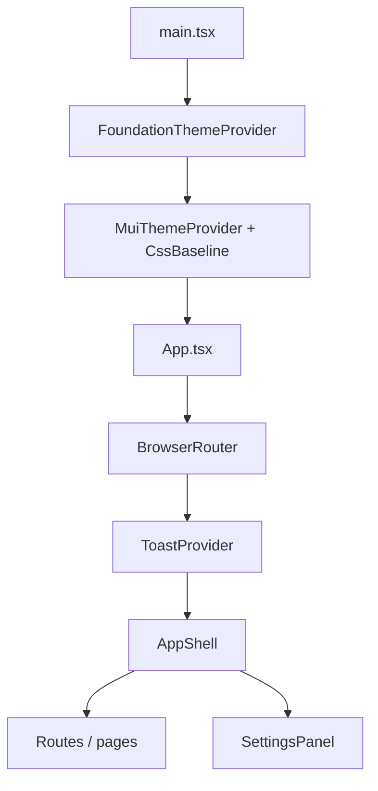

# Foundation — Developer onboarding

**Start here:** from the repo root, run `npm run dev` (or `pnpm dev` / `yarn dev` if you use those clients) to start the Vite dev server. Use `npm run build` for a production build and `npm run preview` to serve the build locally.

This guide explains how the **Foundation** codebase fits together for day-to-day development. For import rules, tokens, naming, and extended conventions, keep **[`CLAUDE.md`](../CLAUDE.md)** open — it is the canonical contributor and agent guide. The root **[`README.md`](../README.md)** is the stock Vite template blurb; treat this file and `CLAUDE.md` as the real project documentation.

---

## 1. Overview

### What this project is

**Foundation** is a reusable **React** front-end starter focused on a full **design system** (90+ UI building blocks), **runtime theming** (brand color, font, light/dark mode), a **responsive app shell** (desktop sidebar + mobile drawer, top bar, command palette), and demo **pages** (component preview, settings, tables, and tests). It is meant to be **cloned** as the starting point for a new SaaS-style web app.

### Where it fits in the overall system

There is **no backend** in this repository: it is a **client-only SPA** served by Vite. Data shown in tables and charts is **sample / placeholder** unless you wire your own APIs. The design system lives under [`src/design-system/`](../src/design-system/); product-specific glue (routes, nav labels, mock user) currently lives in [`src/App.tsx`](../src/App.tsx) and [`src/pages/`](../src/pages/).

---

## 2. High-level flow

### In simple terms

1. The browser loads the app and React starts on the `#root` element.
2. A **theme provider** reads any saved appearance choices from the browser, builds a Material UI theme from them, and wraps the whole app so every screen uses the same colors, fonts, and spacing.
3. The **app** turns on the router, toast notifications, and the main **shell** (sidebar, top bar, content area).
4. You navigate between routes; the main content is whatever React Router renders inside the shell. A **settings** layer (for example theme tweaks) can sit alongside routes as part of the tree.

### In technical terms

1. [`main.tsx`](../src/main.tsx) calls `createRoot(...).render()` with `StrictMode`.
2. The tree is **`FoundationThemeProvider`** → **`App`**.
3. **`FoundationThemeProvider`** ([`ThemeContext.tsx`](../src/design-system/ThemeContext.tsx)) holds `ThemeConfig` in React state, syncs it to `localStorage`, memoizes `generateTheme(config)` into an MUI `Theme`, wraps children with MUI’s `ThemeProvider` and `CssBaseline`, and exposes **`useFoundationTheme()`**.
4. **`App`** ([`App.tsx`](../src/App.tsx)) wraps **`BrowserRouter`** → **`ToastProvider`** → **`AppShell`**. `Routes` render page components; **`SettingsPanel`** is mounted as a sibling under `AppShell` for global theme UI.



Boot snippet (provider order):

```tsx
// src/main.tsx — simplified
createRoot(document.getElementById('root')!).render(
  <StrictMode>
    <FoundationThemeProvider>
      <App />
    </FoundationThemeProvider>
  </StrictMode>,
)
```

---

## 3. Core concepts / basics

- **React function components** — UI is composed from functions returning JSX; state and effects live in hooks.
- **Material UI (MUI)** — Components and styling are centered on MUI v7. Layout primitives (`Box`, `Stack`, `Grid`, `Typography`) and theme hooks are used from `@mui/material` per project rules; **feature UI** comes from the design-system barrel (see [`CLAUDE.md`](../CLAUDE.md) §5).
- **`sx` prop** — Inline style objects that understand **theme tokens** and **breakpoints** (for example `display: { xs: 'none', lg: 'flex' }`).
- **`ThemeConfig`** — Small JSON-serializable object (`brandColor`, `fontFamily`, `mode`) defined in [`themeConfig.ts`](../src/design-system/themeConfig.ts). It is the **source of truth** for user-facing theme choices before they become a full MUI theme.
- **`generateTheme(config)`** — Pure factory in [`generateTheme.ts`](../src/design-system/generateTheme.ts) that maps `ThemeConfig` + [`tokens.ts`](../src/design-system/tokens.ts) into an MUI **`Theme`** (palette, typography, breakpoints, component defaults).
- **Design tokens** — [`tokens.ts`](../src/design-system/tokens.ts) holds spacing, type scale, semantic colors, shadows, etc., and helpers such as chroma-based scales from the brand color.
- **Barrel exports** — Most UI is imported from [`@/design-system/components`](../src/design-system/components/index.ts) so consumers depend on a **stable public API** instead of deep paths.
- **React Router** — Client-side routing (`BrowserRouter`, `Routes`, `Route`); `AppShell` uses `useLocation()` for navigation side effects.
- **Zustand (toasts)** — Global toast list and actions live in [`useToast.ts`](../src/design-system/components/feedback/Toast/useToast.ts); `ToastProvider` renders the list and subscribes to that store.
- **App shell pattern** — `AppShell` owns chrome (nav, header, drawers) and renders **`children`** as the main document surface.

---

## 4. File structure breakdown

Below is a **module-level** map (not every component). Each design-system component usually lives in its own folder with an `index.tsx` entry.

| Location | Role | Main inputs | Main outputs / side effects |
|----------|------|-------------|-------------------------------|
| [`src/main.tsx`](../src/main.tsx) | Vite/React entry; mounts the tree | DOM `#root` | Renders React app |
| [`src/App.tsx`](../src/App.tsx) | Router, toast wrapper, shell, routes, settings | `navConfig`, mock `user`, handlers | Routed UI + settings entry point |
| [`src/design-system/ThemeContext.tsx`](../src/design-system/ThemeContext.tsx) | `FoundationThemeProvider`, `useFoundationTheme`, Google Font loader | `children` | Context value; MUI theme; persists `ThemeConfig`; injects `<link>` for fonts |
| [`src/design-system/themeConfig.ts`](../src/design-system/themeConfig.ts) | Types, defaults, font/color preset lists, `loadThemeConfig` / `saveThemeConfig` | `localStorage` key `foundation:theme` | `ThemeConfig` object |
| [`src/design-system/generateTheme.ts`](../src/design-system/generateTheme.ts) | `generateTheme(config)`; extends MUI breakpoint names | `ThemeConfig`, `tokens` | MUI `Theme` |
| [`src/design-system/tokens.ts`](../src/design-system/tokens.ts) | Static tokens + color scale helpers | Brand hex (via callers) | Token objects / scales |
| [`src/design-system/components/navigation/AppShell/index.tsx`](../src/design-system/components/navigation/AppShell/index.tsx) | Responsive layout, sidebar collapse, mobile drawer, command palette shortcut | `navConfig`, `user`, optional callbacks | Composed layout UI; persists `foundation:sidebar-collapsed` |
| [`src/design-system/components/feedback/Toast/useToast.ts`](../src/design-system/components/feedback/Toast/useToast.ts) | Zustand store for toast queue | `showToast`, etc. | In-memory toast list |
| [`src/design-system/components/feedback/Toast/ToastProvider.tsx`](../src/design-system/components/feedback/Toast/ToastProvider.tsx) | Renders toasts, auto-dismiss | Store subscription | DOM updates / timers |
| [`src/pages/Preview/`](../src/pages/Preview/), [`src/pages/Settings/`](../src/pages/Settings/), etc. | Demo and settings screens | Router, theme hooks | Page-level UI |

**Design-system component areas** (under [`src/design-system/components/`](../src/design-system/components/)):

- **`primitives/`** — Buttons, inputs, toggles, selects, checkboxes, radios, etc.
- **`display/`** — Badges, avatars, chips, tags, feeds, copy helpers, etc.
- **`cards/`** — Card variants, stats/metrics, list cards, etc.
- **`charts/`** — Recharts-based charts and chart chrome.
- **`data-table/`** — Table, toolbar, filters, pagination, inline edit, etc.
- **`feedback/`** — Toasts, dialogs, drawers, loading, progress, alerts.
- **`forms/`** — Rich text, file upload, form field helpers, tag input, etc.
- **`navigation/`** — `AppShell`, sidebar, top bar, breadcrumb, command palette.
- **`infographics/`** — SVG-style infographic widgets.

**Dependencies between layers (conceptual):** `App` → design-system **navigation + feedback**; pages → design-system **components + ThemeContext**; `generateTheme` → `themeConfig` + `tokens`; most components → MUI + `tokens` / `useTheme`.

---

## 5. Data flow

### Theme

1. On first paint, `FoundationThemeProvider` initializes state with **`loadThemeConfig()`** (reads `localStorage`).
2. Any change to `config` runs **`saveThemeConfig(config)`** and **`loadGoogleFont(config.fontFamily)`** (unless using the system Helvetica stack).
3. **`useMemo(() => generateTheme(config), [config])`** recomputes the MUI theme; **`MuiThemeProvider`** pushes it to the subtree.
4. **Settings UI** (and any other consumer) calls **`useFoundationTheme()`** and uses `setBrandColor`, `setFontFamily`, `setMode`, `toggleMode`, or `setConfig` to update state — which re-triggers persistence and theme regeneration.

```text
localStorage ("foundation:theme")
        ↕ load / save
ThemeConfig state (React)
        → generateTheme → MUI Theme
        → ThemeProvider → all MUI sx / styled components
```

### App shell and routing

- **Sidebar collapsed** boolean is read from / written to **`localStorage`** key `foundation:sidebar-collapsed` when the user toggles desktop collapse.
- **`useMediaQuery(breakpoints.up('lg'))`** drives desktop vs mobile chrome; resizing to desktop **closes** the mobile drawer.
- **`useLocation().pathname`** triggers an effect that **closes** the mobile drawer on navigation.
- **Command palette** listens for **Cmd+K / Ctrl+K** and toggles open state (global shortcut).

### Toasts

- Any code that imports **`useToast.getState()`** or uses the hook calls **`showToast({ title, variant, ... })`** → Zustand appends a toast with a generated **`id`** → **`ToastProvider`** renders items and schedules dismiss animations / removal.

### APIs and server state

- This template **does not** ship a data-fetching layer (no React Query, no REST client). Charts and tables use **in-memory or static** data in demo pages unless you add your own integration.

---

## 6. Key logic and decisions

- **Defensive theme hydration** — `loadThemeConfig` validates shape and `mode` values and falls back to **`DEFAULT_THEME_CONFIG`** on missing, invalid, or thrown JSON parse errors ([`themeConfig.ts`](../src/design-system/themeConfig.ts)). This prevents one bad `localStorage` write from bricking the UI.
- **Font loading** — `loadGoogleFont` builds a Google Fonts CSS URL, checks existing `<link rel="stylesheet">` nodes to **avoid duplicates** on hot reload ([`ThemeContext.tsx`](../src/design-system/ThemeContext.tsx)), and skips network loading for **Helvetica Neue** (system stack).
- **Single brand driver** — Primary scales are derived from **`config.brandColor`** via chroma helpers; neutrals are tied to the same seed for a coherent palette ([`generateTheme.ts`](../src/design-system/generateTheme.ts), [`tokens.ts`](../src/design-system/tokens.ts)).
- **MUI component defaults** — `generateTheme` centralizes overrides (for example `MuiButton` text transform, `MuiTextField` size) so apps look consistent without repeating props everywhere.
- **Custom breakpoints** — Eight breakpoints (`xxl`, `xxxl`, `uhd`, …) are declared via **module augmentation** on `@mui/material/styles` so TypeScript knows the extra keys ([`generateTheme.ts`](../src/design-system/generateTheme.ts)).
- **Strict context usage** — `useFoundationTheme` **throws** if used outside `FoundationThemeProvider`, surfacing integration mistakes early ([`ThemeContext.tsx`](../src/design-system/ThemeContext.tsx)).
- **Toast IDs** — Prefer **`crypto.randomUUID()`** when available, with a time/random fallback for older environments ([`useToast.ts`](../src/design-system/components/feedback/Toast/useToast.ts)).

---

## 7. External dependencies

Values below reflect [`package.json`](../package.json) at the time of writing (ranges show allowed semver updates).

| Package | Role in this codebase |
|---------|------------------------|
| `react`, `react-dom` | UI runtime |
| `vite`, `@vitejs/plugin-react` | Dev server, HMR, production bundling |
| `typescript`, `typescript-eslint`, `eslint`, … | Type-checking and linting |
| `@mui/material` | Core component library and layout primitives |
| `@emotion/react`, `@emotion/styled` | Required styling layer for MUI |
| `@mui/icons-material` | Icons inside MUI-heavy widgets (close, sort, toast icons, etc.) per [`CLAUDE.md`](../CLAUDE.md) |
| `@mui/lab` | Lab components (for example timeline) where used |
| `@mui/x-date-pickers` | Date/time picker components |
| `react-router-dom` | Declarative routing, `useLocation`, etc. |
| `recharts` | Chart primitives used by chart components |
| `chroma-js` (+ `@types/chroma-js`) | Programmatic color scales from brand color |
| `dayjs` | Date formatting where used |
| `lucide-react` | Primary icon set for navigation and feature UI |
| `@tiptap/*` | Rich text editor stack (StarterKit, links, placeholder, underline, PM) |
| `zustand` | Lightweight global store for toast queue |

**Not installed in `package.json` but mentioned in [`CLAUDE.md`](../CLAUDE.md):** React Hook Form and Zod are documented as the **recommended** form stack **when you add forms** — install them when a feature needs them.

---

## 8. Edge cases / assumptions

- **Browser-only APIs** — `localStorage`, `document`, `window`, and dynamic `<link>` injection assume a **browser**; there is no SSR path in this template.
- **Private / blocked storage** — If `localStorage` throws or is unavailable, theme persistence may fail silently or fall back depending on browser behavior; production apps sometimes add a try/catch wrapper if they must support locked-down environments.
- **Corrupt or migrated JSON** — Old keys or shapes in `foundation:theme` reset to defaults thanks to validation — but **renaming fields** on `ThemeConfig` without a migration will **reset user preferences** once validation fails.
- **Font network** — Google Fonts require network access; failures result in **fallback** system fonts, not a crash.
- **Provider boundaries** — Calling `useFoundationTheme` outside the provider throws by design.
- **Demo data** — `navConfig`, routes, and `mockUser` in [`App.tsx`](../src/App.tsx) are **placeholders**, not auth.

---

## 9. How to modify / extend

### Relatively safe places to start

- Add or change **routes** in [`App.tsx`](../src/App.tsx) and new files under [`src/pages/`](../src/pages/).
- Add **nav entries** by extending `navConfig` (shape typed as `NavConfig` from the design system).
- Add a **new presentational component** under the appropriate `src/design-system/components/<area>/` folder, export it from the area’s `index.ts`, then from [`components/index.ts`](../src/design-system/components/index.ts) if it should be public.
- Tune **marketing / default brand** via [`tokens.ts`](../src/design-system/tokens.ts) (`BRAND_COLOR`) as described in [`CLAUDE.md`](../CLAUDE.md).

### Higher-risk / wide-blast-radius changes

- Editing **`generateTheme`** palette structure, typography contract, or **breakpoint values** can break many `sx` layouts across the app.
- Changing **`ThemeConfig`** field names or allowed values without a **migration** for `foundation:theme` may wipe or confuse stored settings.
- Bypassing barrel imports and pulling **deep internal paths** creates tight coupling and makes refactors painful — follow [`CLAUDE.md`](../CLAUDE.md) import rules instead.

---

## 10. Summary

Foundation is a **Vite + React + TypeScript** SPA that centers on a **Material UI theme** generated from a small, persisted **`ThemeConfig`**. The app boots through **`FoundationThemeProvider`**, then **`App`** wires routing, **toasts**, and the **`AppShell`** layout around your pages. Most day-to-day work happens in **`src/pages/`** for product flows and **`src/design-system/components/`** for reusable UI, while [`CLAUDE.md`](../CLAUDE.md) remains the detailed rulebook for imports, tokens, and conventions. There is **no built-in backend**; you bring your own data layer when you outgrow the demos.
