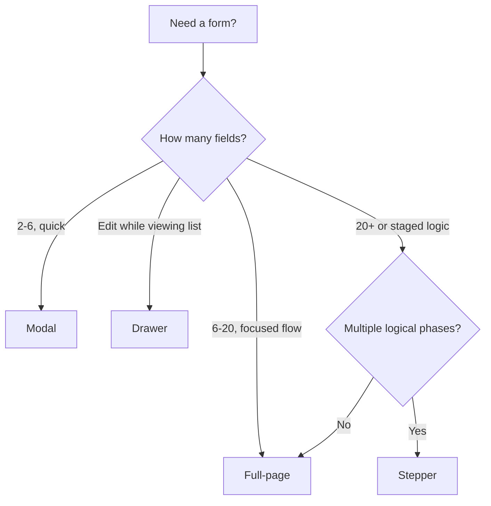

# Foundation — Form Patterns Guide

How to build consistent forms with `FormField`, `FormSection`, and the four layout variants used in Billings.

**Related docs:** [MODULE_GUIDE.md](./MODULE_GUIDE.md) · [PROJECT_STARTUP.md](./PROJECT_STARTUP.md) · [CLAUDE.md](./CLAUDE.md)

**Reference implementation:** `src/design-system/UIComponents/Templates/BillingTemplate/`

---

## Core Form Components

### FormField

**File:** `src/design-system/UIComponents/Forms/FormField/index.tsx`

| Prop | Type | Description |
|------|------|-------------|
| `label` | `string` | Field label |
| `required` | `boolean` | Shows red `*` |
| `optional` | `boolean` | Shows "optional" text |
| `hint` | `string` | Right-aligned hint in label row |
| `error` | `boolean` | Error styling on helper text |
| `helperText` | `string` | Helper or error message below input |
| `labelFor` | `string` | Associates label with input `id` |
| `children` | `ReactNode` | Input component |

```tsx
import { FormField, Input } from '@/design-system/components'

<FormField
  label="Email address"
  required
  error={Boolean(errors.email)}
  helperText={errors.email ?? 'We will never share your email'}
>
  <Input
    type="email"
    placeholder="you@example.com"
    value={email}
    onChange={(value) => setEmail(value)}
  />
</FormField>
```

### FormSection

**File:** `src/design-system/UIComponents/Forms/FormSection/index.tsx`

| Prop | Type | Default | Description |
|------|------|---------|-------------|
| `title` | `string` | — | Uppercase section heading |
| `description` | `string` | — | Subtitle under title |
| `columns` | `1 \| 2 \| 3` | `2` | Grid columns (1 col on mobile) |
| `divider` | `boolean` | `false` | Divider below section |
| `collapsible` | `boolean` | `false` | Collapse toggle |
| `defaultCollapsed` | `boolean` | `false` | Initial collapsed state |

```tsx
import { FormField, FormSection, Input, Select } from '@/design-system/components'

<FormSection title="Personal information" columns={2} divider>
  <FormField label="First name" required>
    <Input value={firstName} onChange={setFirstName} />
  </FormField>
  <FormField label="Last name" required>
    <Input value={lastName} onChange={setLastName} />
  </FormField>
  <FormField label="Role">
    <Select
      value={role}
      onChange={(val) => setRole(String(val))}
      options={[
        { label: 'Admin', value: 'admin' },
        { label: 'User', value: 'user' },
      ]}
    />
  </FormField>
</FormSection>
```

Grid collapses to **one column** below the `md` breakpoint.

---

## Form Variants Overview

| # | Variant | Foundation component | Typical size | Billings file |
|---|---------|---------------------|--------------|---------------|
| 1 | Modal | `Modal` | `size="md"` (~500–600px) | `BillingModal.tsx` |
| 2 | Drawer | `Drawer` | `width={500}` | `BillingDrawer.tsx` |
| 3 | Full-page | `BillingFormCard` + route | max-width 960px | `FormPage.tsx` |
| 4 | Stepper | `Stepper` + step panels | full content width | `StepperFormPage.tsx` |

All variants should reuse **`BillingFormSections`** (or your module’s equivalent) so fields stay consistent.

---

## 1. Modal Form

**Use when:** Quick entry, 2–8 fields, user stays on listing context.

**Billings implementation:**

```tsx
// BillingModal.tsx — simplified
import { useState, useEffect } from 'react'
import { Box } from '@mui/material'
import { Button, Modal } from '@/design-system/components'
import type { InvoiceFormData } from '../types'
import { EMPTY_FORM } from '../types'
import BillingFormSections from './BillingFormSections'

export default function BillingModal({
  open,
  onClose,
  onSave,
  title = 'Add invoice',
  subtitle = 'Fill in the details to create an invoice',
  initialData,
}: {
  open: boolean
  onClose: () => void
  onSave?: (data: InvoiceFormData) => void
  title?: string
  subtitle?: string
  initialData?: Partial<InvoiceFormData>
}) {
  const [formData, setFormData] = useState<InvoiceFormData>({ ...EMPTY_FORM, ...initialData })

  useEffect(() => {
    if (open) setFormData({ ...EMPTY_FORM, ...initialData })
  }, [open, initialData])

  return (
    <Modal
      open={open}
      onClose={onClose}
      title={title}
      subtitle={subtitle}
      size="md"
      footer={
        <Box sx={{ display: 'flex', gap: 1, justifyContent: 'flex-end', width: '100%' }}>
          <Button variant="outlined" color="secondary" onClick={onClose}>Cancel</Button>
          <Button variant="outlined" color="warning" onClick={() => onSave?.(formData)}>
            Save as draft
          </Button>
          <Button variant="contained" onClick={() => { onSave?.(formData); onClose() }}>
            Save
          </Button>
        </Box>
      }
    >
      <BillingFormSections
        data={formData}
        onChange={setFormData}
        showLineItems={false}
        showNotes={false}
      />
    </Modal>
  )
}
```

**With validation:**

```tsx
const [errors, setErrors] = useState<Record<string, string>>({})

const validate = (data: InvoiceFormData) => {
  const next: Record<string, string> = {}
  if (!data.invoiceNo.trim()) next.invoiceNo = 'Invoice number is required'
  if (!data.client) next.client = 'Client is required'
  return next
}

const handleSave = () => {
  const next = validate(formData)
  if (Object.keys(next).length) {
    setErrors(next)
    return
  }
  onSave?.(formData)
  onClose()
}

// In FormField:
<FormField label="Invoice no." required error={Boolean(errors.invoiceNo)} helperText={errors.invoiceNo}>
  <Input value={formData.invoiceNo} onChange={(v) => patch({ invoiceNo: v })} />
</FormField>
```

---

## 2. Drawer Form

**Use when:** Editing alongside a list or detail view; user keeps spatial context.

**Billings implementation:**

```tsx
// BillingDrawer.tsx — simplified
import { Drawer, Button } from '@/design-system/components'

<Drawer
  open={open}
  onClose={onClose}
  title="Edit invoice"
  subtitle="Update item information"
  width={500}
  footer={
    <Box sx={{ display: 'flex', flexDirection: 'column', gap: 1, width: '100%' }}>
      <Button variant="outlined" color="secondary" fullWidth onClick={onClose}>Cancel</Button>
      <Button variant="contained" fullWidth onClick={handleSave}>Save</Button>
    </Box>
  }
>
  <BillingFormSections data={formData} onChange={setFormData} showLineItems={false} />
</Drawer>
```

Open from detail page:

```tsx
const [drawerOpen, setDrawerOpen] = useState(false)

<Button onClick={() => setDrawerOpen(true)}>Quick edit</Button>
<BillingDrawer
  open={drawerOpen}
  onClose={() => setDrawerOpen(false)}
  initialData={invoiceToFormData(item)}
  onSave={handleUpdate}
/>
```

---

## 3. Full-Page Form

**Use when:** Many sections, line items, attachments, or primary create/edit flow.

**Structure:**

1. `BackButton` + `Breadcrumb` — **outside** the card
2. `BillingFormCard` — header actions, scrollable body, footer actions
3. `BillingFormSections` — all fields

**Billings page (`FormPage.tsx`):**

```tsx
import { Box } from '@mui/material'
import { useNavigate, useParams } from 'react-router-dom'
import { BackButton, Breadcrumb, useToast } from '@/design-system/components'
import {
  BillingFormSections,
  BillingFormCard,
  EMPTY_FORM,
} from '@/design-system/UIComponents/Templates/BillingTemplate'

export default function FormPage() {
  const { id } = useParams<{ id: string }>()
  const navigate = useNavigate()
  const { showToast } = useToast()
  const isEdit = Boolean(id)

  const [formData, setFormData] = useState<InvoiceFormData>({ ...EMPTY_FORM })

  return (
    <Box>
      <Box sx={{ display: 'flex', alignItems: 'center', gap: 1, mb: 3 }}>
        <BackButton href="/billings" />
        <Breadcrumb
          items={[
            { label: 'Billings', href: '/billings' },
            { label: isEdit ? 'Edit invoice' : 'Add invoice' },
          ]}
        />
      </Box>

      <Box sx={{ maxWidth: 960, mx: 'auto' }}>
        <BillingFormCard
          title={isEdit ? 'Edit invoice' : 'Add invoice'}
          subtitle="Fill in the details to create an invoice"
          onCancel={() => navigate('/billings')}
          onSaveDraft={() => showToast({ title: 'Draft saved', variant: 'info' })}
          onSave={() => {
            showToast({ title: 'Invoice saved', variant: 'success' })
            navigate('/billings')
          }}
        >
          <BillingFormSections data={formData} onChange={setFormData} />
        </BillingFormCard>
      </Box>
    </Box>
  )
}
```

**ASCII layout:**

```
[← Back]  Billings / Add invoice

┌────────────────────────────────────────────────────────┐
│ Add invoice              [Cancel] [Draft] [Save]       │
├────────────────────────────────────────────────────────┤
│ INVOICE DETAILS                                        │
│ [Invoice no.]  [Date]                                  │
│ [Client]       [Project]                               │
│                                                        │
│ LINE ITEMS (optional section)                          │
├────────────────────────────────────────────────────────┤
│                        [Cancel] [Draft] [Save]         │
└────────────────────────────────────────────────────────┘
```

---

## 4. Stepper Form

**Use when:** Logical phases, review step, or reduced cognitive load.

**Billings (`StepperFormPage.tsx`)** uses Foundation `Stepper` with 4 steps:

```tsx
const STEPS = [
  { label: 'Basic info', description: 'Invoice and client details' },
  { label: 'Line items', description: 'Products and services' },
  { label: 'Totals & attachments', description: 'Summary and files' },
  { label: 'Review', description: 'Confirm and save' },
]

<Stepper steps={STEPS} activeStep={activeStep} sx={{ mb: 4 }} />

{activeStep === 0 && (
  <BillingFormSections
    data={formData}
    onChange={setFormData}
    showLineItems={false}
    showNotes={false}
    showPaymentDetails={false}
  />
)}
{activeStep === 1 && (
  <BillingFormSections
    data={formData}
    onChange={setFormData}
    showLineItems
    showNotes={false}
    showPaymentDetails={false}
  />
)}
{activeStep === 3 && (
  <BillingDetailSections invoice={formToReviewInvoice(formData)} />
)}
```

**Navigation footer:**

```tsx
<Box sx={{ display: 'flex', justifyContent: 'flex-end', gap: 1 }}>
  <Button disabled={activeStep === 0} onClick={() => setActiveStep((s) => s - 1)}>
    Previous
  </Button>
  {activeStep === STEPS.length - 1 ? (
    <Button variant="contained" onClick={handleFinish}>Finish</Button>
  ) : (
    <Button variant="contained" onClick={() => setActiveStep((s) => s + 1)}>Next</Button>
  )}
</Box>
```

Validate **per step** before calling `setActiveStep(s + 1)`.

---

## Form Field Types

Foundation inputs use a consistent `value` + `onChange(value)` API.

### Text

```tsx
<FormField label="Name" required>
  <Input placeholder="Enter name" value={name} onChange={setName} />
</FormField>
```

### Email / number / date

```tsx
<FormField label="Email" required>
  <Input type="email" value={email} onChange={setEmail} />
</FormField>

<FormField label="Amount" required>
  <Input type="number" value={String(amount)} onChange={(v) => setAmount(Number(v))} />
</FormField>

<FormField label="Invoice date" required>
  <Input type="date" value={date} onChange={setDate} />
</FormField>
```

### Textarea

```tsx
<FormField label="Notes">
  <Textarea value={notes} onChange={setNotes} minRows={4} placeholder="Internal notes" />
</FormField>
```

### Select

```tsx
<FormField label="Client" required>
  <Select
    placeholder="Select client"
    value={client}
    onChange={(val) => setClient(String(val))}
    options={[
      { label: 'Acme Corp', value: 'Acme Corp' },
      { label: 'Beta LLC', value: 'Beta LLC' },
    ]}
  />
</FormField>
```

### File upload

```tsx
<FormField label="Attachments">
  <FileUpload
    value={files}
    onChange={setFiles}
    accept=".pdf,.png,.jpg"
  />
</FormField>
```

### Toggle

```tsx
<FormField label="Enable notifications" hint="Email alerts">
  <Toggle checked={enabled} onChange={setEnabled} />
</FormField>
```

### DatePicker (design system)

```tsx
import { DatePicker } from '@/design-system/components'

<FormField label="Due date">
  <DatePicker value={dueDate} onChange={setDueDate} />
</FormField>
```

---

## Shared Form Sections (Billings)

`BillingFormSections.tsx` demonstrates multi-section forms:

```tsx
<FormSection title="Invoice details" columns={2}>
  <FormField label="Invoice no." required>...</FormField>
  <FormField label="Invoice date" required>...</FormField>
  <FormField label="Client" required>...</FormField>
  <FormField label="Project" required>...</FormField>
</FormSection>

{showLineItems && <BillingLineItems items={data.lineItems} onChange={...} />}

{showNotes && (
  <FormSection title="Notes & attachments" columns={2}>
    <FormField label="Notes"><Textarea ... /></FormField>
    <FormField label="Attachments"><FileUpload ... /></FormField>
  </FormSection>
)}
```

Use props like `showLineItems`, `showNotes` to trim sections per variant (modal vs full-page vs step).

---

## Validation Pattern

```tsx
const [formData, setFormData] = useState(EMPTY_FORM)
const [errors, setErrors] = useState<Record<string, string>>({})

function validate(data: typeof EMPTY_FORM) {
  const e: Record<string, string> = {}
  if (!data.name.trim()) e.name = 'Name is required'
  if (!data.email.includes('@')) e.email = 'Invalid email'
  return e
}

function handleSubmit() {
  const e = validate(formData)
  setErrors(e)
  if (Object.keys(e).length) return
  // submit...
}
```

Display errors on `FormField`:

```tsx
<FormField
  label="Email"
  required
  error={Boolean(errors.email)}
  helperText={errors.email}
>
  <Input type="email" value={formData.email} onChange={(v) => patch({ email: v })} />
</FormField>
```

---

## Best Practices

1. **Pick the right variant** — modal for quick; full-page for complex; stepper for staged flows
2. **One `FormSections` component** — shared across modal, drawer, page, steps
3. **Reset on open** — `useEffect` when `open` flips true (modal/drawer)
4. **Validate on submit** (or per step) — not on every keystroke
5. **Specific error messages** — "Invalid email format" not "Error"
6. **Toast after save** — `useToast({ title, variant: 'success' })`
7. **Disable actions while loading** — prevent double submit
8. **Empty grid cells** — use `<Box />` placeholders to align 2-column grids
9. **Pre-fill edit mode** — map API entity → `FormData` in `useState` initializer
10. **Test mobile** — `FormSection` stacks to one column automatically

---

## Variant Selection Guide



---

## See Also

- [MODULE_GUIDE.md](./MODULE_GUIDE.md) — listing + detail + wiring routes
- [PROJECT_STARTUP.md](./PROJECT_STARTUP.md) — project setup
- [CLAUDE.md](./CLAUDE.md) — `Modal`, `Drawer`, `Input`, tokens
- Live showcase: `src/pages/ComponentLibrary/components/FormsShowcase.tsx`
